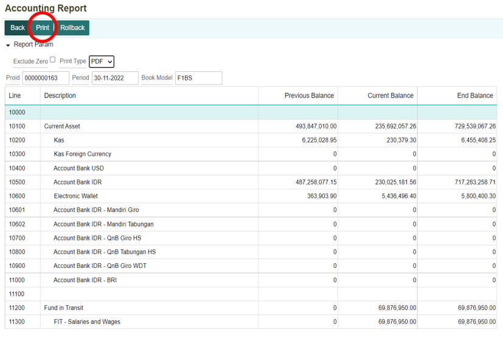

# Membuat Laporan Keuangan


## Buat Laporan Keuangan

Laporan keuangan merupakan laporan yang menunjukkan kondisi keuangan perusahaan pada saat ini atau dalam suatu periode tertentu. Di dalam laporan keuangan akan terlihat dari mulai keuntungan, pengeluaran, penjualan, dan sebagainya. Untuk membentuk laporan keuangan di dalam sistem AKOR, langkah pertama yang dilakukan adalah pembuatan book model di dalam menu Book Model. Pembuatan book model ini dibuat untuk menambahkan komponen-komponen yang akan terdapat di dalam laporan keuangan dan bagaimana setiap komponen tersebut dapat terlihat secara rinci di dalam laporan keuangan. 

Kemudian setelah book model telah terbentuk, maka langkah selanjutnya yaitu membuat atau memproses laporan keuangan (baik balance sheet maupun profit loss) dapat dilakukan di dalam menu Accounting Report. Maka pada tahap ini akan dijelaskan dari mulai membuat book model hingga sampai terbentuk laporan keuangan.

---

## Membuat Book Model

1. Untuk membuat laporan keuangan, terlebih dahulu dilakukan pembuatan Book Model. Jalankan menu Book Model yang terdapat pada module Accounting. 

    

2. Klik tombol Report Type untuk menambahkan jenis laporan keuangan yang baru.

    

3. Maka akan ditampilkan form untuk menambahkan Report Type baru. Lalu setelah diisi setiap kolom yang ada, klik tombol Save untuk menyimpan data.

     

Tombol Add untuk menambahkan record (kolom) baru. Sedangkan tombol Remove untuk menghapus record (kolom).

```{note}  Isi semua kolom yang bertanda (*)
```

**Informasi Kolom:**

| No. | Kolom        | Keterangan                      |
|-----|--------------|---------------------------------|
| 1   | Report Type  | Kode Laporan                    |
| 2   | Description  | Keterangan Laporan Keuangan     |


4. Klik tombol New untuk membuat **Book Model** yang baru.

    

5. Maka akan ditampilkan form membuat book model baru. Isi dan lengkapi kolom-kolom yang ada. Kemudian klik tombol **Save** untuk menyimpan data.

    

Tombol **Add** untuk menambahkan *record* (kolom) baru. Sedangkan tombol Remove untuk menghapus record (kolom).

```{note}  Isi semua kolom yang bertanda (*)
 ```

Informasi Kolom:

| No. | Kolom             | Keterangan                  |
|-----|-------------------|-----------------------------|
| 1   | Book Model        | Kode Book Model             |
| 2   | Description       | Keterangan Book Model       |
| 3   | Chart of Account  | Kode Kelompok Akun          |
| 4   | Report Type       | Kode untuk Tipe Laporan     |
| 5   | Calculation       | Perhitungan                 |
| 6   | Line              | Nomor Urut                  |
| 7   | Account           | Nama Akun                   |
| 8   | Sum Lines         | Penjumlahan Baris           |
| 9   | Formula           | Rumus                       |
| 10  | Cr.               | -                           |
| 11  | Format            | Tata Letak untuk Dokumen    |
| 12  | Display           | -                           |


## Membuat Laporan Keuangan

1. Untuk membuat laporan keuangan yang baru, dilakukan di dalam menu **Accounting Report (ACR)**, yang terdapat pada module Accounting.

    

2. Kemudian akan ditampilkan form untuk membuat Accounting Report yang baru. Isi dan lengkapi kolom yang ada.

    

 ```{note}  Isi semua kolom yang bertanda (*)
 ```

**Informasi Kolom:**

| No. | Kolom           | Keterangan                                   |
|-----|-----------------|----------------------------------------------|
| 1   | Book Model      | Jenis Laporan yang Ingin Dibuat              |
| 2   | Period          | Periode Pembuatan Laporan                    |
| 3   | Company         | Kode Perusahaan                              |
| 4   | Business Area   | Kode Area Bisnis                             |
| 5   | Business Center | Kode Tempat Bisnis Berlangsung               |

 

3. Klik tombol **Process** untuk memproses laporan yang diinginkan.

    

4. Kemudian akan ditampilkan notifikasi konfirmasi untuk memproses laporan keuangan. Klik tombol **OK** bila setuju. Dan akan muncul notifikasi bahwa proses telah selesai dan berhasil.

    

5. Apabila tidak ingin memproses laporan keuangan maka klik tombol **Cancel**.

    

## Membuka Laporan Keuangan

1. Kemudian klik tombol **List**. Maka akan ditampilkan list dari **Accounting Report** yang sudah diproses sebelumnya. 

    

2. Klik tombol **Open** untuk membuka laporan keuangan

    

## Print Laporan Keuangan

1. Maka akan ditampilkan **Accounting Report** yang diinginkan. Klik tombol **Print** untuk mengunduh laporan keuangan. Print type nya dapat diunduh dalam bentuk PDF atau Excel.

    

2. Berikut **Accounting Report** yang terunduh dalam bentuk PDF.

    

3. Apabila ingin menghapus laporan keuangan, klik tombol **Rollback**.

    

4. Kemudian akan tampil notifikasi konfirmasi untuk menghapus laporan keuangan. Klik tombol **OK** apabila benar-benar ingin menghapus laporan tersebut.

     

5. Untuk membatalkan penghapusan laporan keuangan, klik tombol **Cancel**.

    

```{tableofcontents}
```
