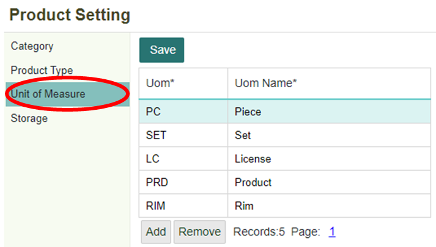

# Membuat Master Barang


## Buat Master Barang

Master data adalah daftar barang-barang yang digunakan untuk menunjang kegiatan usaha bisnis. Dimana master barang akan berisi mengenai informasi barang yang dimiliki perusahaan, baik itu barang aset maupun barang dagang. Ketika ingin membuat dokumen pembelian barang maka hal pertama yang dilakukan adalah membuat master barang terlebih dahulu. Tetapi sebelum membuat data master barang atau produk terlebih dahulu perlu dilakukan pengaturan kategori, jenis dan satuan untuk produk. Setelah pengaturan selesai dibuat barulah dapat dibuat data master barang atau produk. Untuk melakukan pengaturan kategori, jenis dan satuan produk atau barang dapat dilakukan di dalam menu Product Setting. 

 ---

Jalankan menu Product Setting (PRS) pada module Product Management.


## Membuat Pengaturan Category

1. Klik sub menu **Category**.

    


2. Untuk menambahkan kategori klik tombol **Add**. Maka akan tampil kolom kosong untuk diisi data baru.

    

    

    ```{note} * Isi semua kolom yang bertanda (*)
	* Kolom Category ID harus unik
    ```

    Informasi Kolom:

    | No. | Kolom           | Keterangan       |
    |-----|-----------------|------------------|
    | 1   | Category ID     | Kode Kategori    |
    | 2   | Category Name   | Nama Kategori    |
    | 3   | Description     | Keterangan       |


3. Klik tombol **Save** untuk menyimpan data. Lalu akan muncul notifikasi data berhasil disimpan. Klik tombol **OK**.

    

    
    

## Membuat Pengaturan Product Type

1. Klik sub menu **Product Type**.

    

2. Untuk menambahkan Product Type klik tombol **Add**. Maka akan tampil kolom kosong untuk diisi data baru.

    
    

    

    ```{note} * Isi semua kolom yang bertanda (*)
	* Kolom Product Type harus unik
    ```

Informasi Kolom:

| No. | Kolom      | Keterangan                                                                                              |
|----|------------|------------------------------------------------------------------------------------|
| 1   | Product Type | Kode Tipe Produk                                                                                        |
| 2   | Name       | Nama Tipe Produk                                                                                       |
| 3   | Stocktype  | Tipe Stok (Stock untuk barang dagang, Non Stock untuk alat-alat perlengkapan, dan Fixed Asset untuk Aset Tetap) |
| 4   | Description | Keterangan                                                                                             |

 

3. Klik tombol **Save** untuk menyimpan data. Lalu akan muncul notifikasi data berhasil disimpan. Klik tombol **OK**.

    
    

    
    

## Membuat Pengaturan Unit of Measure

1. Klik sub menu Unit of Measure.

    

2. Untuk menambahkan Unit of Measure klik tombol **Add**. Maka akan tampil kolom kosong untuk diisi data baru.

    
    
    

    ```{note} * Isi semua kolom yang bertanda (*)
	* Kolom Uom harus unik
    ```

**Informasi Kolom:**

| No. | Kolom     | Keterangan                |
|-----|-----------|---------------------------|
| 1   | Uom       | Kode Satuan               |
| 2   | Uom Name  | Satuan Barang / Produk    |

 

3. Klik tombol **Save** untuk menyimpan data. Lalu akan muncul notifikasi data berhasil disimpan. Klik tombol **OK**.

    
    
    

## Membuat Data Product Master
1. Jalankan menu **Product Master (PRMS)** pada module **Product Management**.

    

2. Untuk menambahkan data Product Master klik **ikon** .

    
    

3. Selanjutnya akan tampil form seperti berikut.

    
    
    ```{note} 	* Isi semua kolom yang bertanda (*)
	* Kolom Product ID harus unik
    ```


Informasi Kolom:

| No. | Kolom            | Keterangan          |
|-----|------------------|---------------------|
| 1   | Product ID       | Kode Produk         |
| 2   | Product Name     | Nama Produk         |
| 3   | Category         | Kategori Produk     |
| 4   | Product Type     | Tipe Produk         |
| 5   | Unit of Measure  | Satuan Produk       |
| 6   | Description      | Keterangan          |

 

4. Klik tombol **Save** untuk menyimpan data. Lalu akan muncul notifikasi data berhasil disimpan. Klik tombol **OK**.

    

    
    

## Menambahkan Gambar Barang atau Produk
1. Klik ikon  yang dilingkari

    
    

2. Lalu pilih gambar yang ada pada penyimpanan perangkat.

    
    

3. Secara otomatis gambar telah disimpan.

    
    

## Menambahkan Harga Jual Barang atau Produk

1. Klik tombol **Sales Price** untuk menambahkan harga jual.

    

2. Lalu akan tampil dialog Sales Price seperti berikut:

    
    
3. Klik tombol **Add** lalu akan tampil field kosong yang siap diisi data.

    
    
```{note} Isi semua kolom yang bertanda (*)
```

**Informasi Kolom:**


| No. | Kolom          | Keterangan            |
|-----|----------------|-----------------------|
| 1   | Company        | Kode Perusahaan       |
| 2   | Business Area  | Kode Area Bisnis      |
| 3   | Currency       | Kode Mata Uang        |
| 4   | Unit Price     | Harga Jual            |

 

4. Klik tombol **Save** untuk menyimpan data. Lalu akan muncul notifikasi data berhasil disimpan. Klik tombol **OK**.

    

    
    

    


