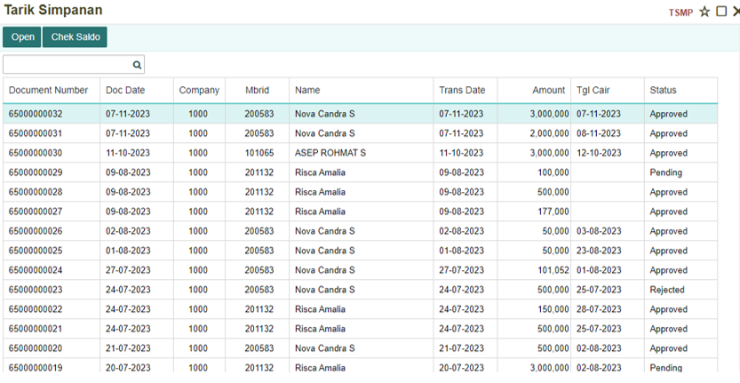
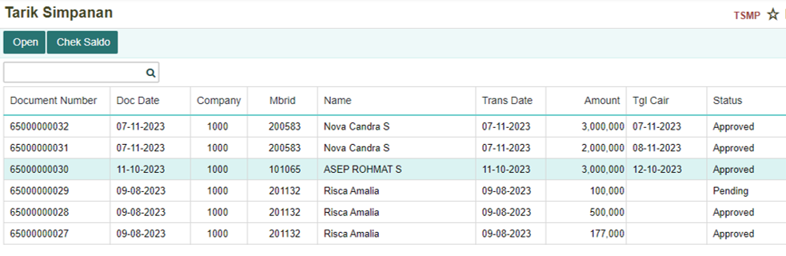
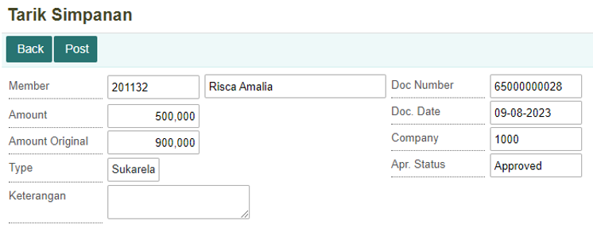
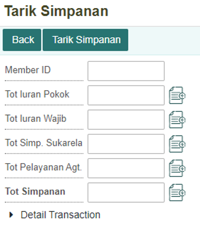
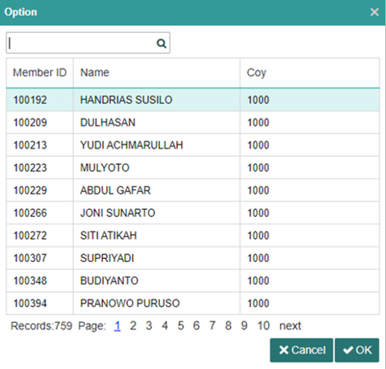
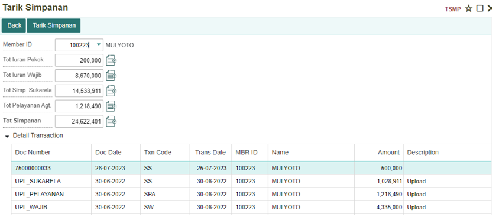
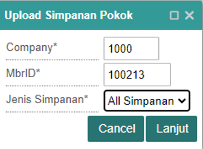

# Langkah-Langkah Melakukan Tarik Simpanan

## Menu Tarik Simpanan
 
Dalam menu Tarik Simpanan, Anda dapat melihat pengajuan penarikan pada simpanan, ditandai dengan status **“Approved”** sebagai konfirmasi bahwa simpanan bisa ditarik, **“Pending”** simpanan masih berada dalam proses. Terdapat dua menu di sini:

   

| No. | Kolom         | Keterangan                              |
|-----|---------------|-----------------------------------------|
| 1   | Doc. Number   | Kode generate untuk Penarikan           |
| 2   | Doc. Date      | Tanggal Penarikan                       |
| 3   | Company        | Nomor Perusahaan                        |
| 4   | Mbrid          | Member ID                               |
| 5   | Name           | Nama Member                             |
| 6   | Trans. Date    | Tanggal Transaksi                       |
| 7   | Amount         | Jumlah Penarikan                        |
| 8   | Tgl. Cair      | Tanggal Pencairan Dana                  |
| 9   | Status         | Status penarikan, apa sudah dikonfirmasi atau belum. |

###	Melihat detil dari Simpanan.

Highlight salah satu data/record kemudian tekan tombol **“Open”**.

Berikutnya akan muncul tampilan dari record yang di highlight seperti di bawah ini:

   

###	Menarik Saldo Simpanan

Anda dapat menarik Saldo Simpanan dengan cara menekan **“Check Saldo”**, kemudian akan dialihkan kebagian sebagai berikut:

 
   

Tekan member ID dan pilih member yang ingin Simpanannya ditarik.

   
 

Setelah memilih member maka akan diperlihatkan detil daripada member seperti di bawah ini:

 
   

Akan muncul detil dari transaksi simpan yang telah dilakukan member. Tekan **“Tarik Simpanan”** untuk mengajukan penarikan simpanan apa yang ingin dilaksanakan:

   

 
