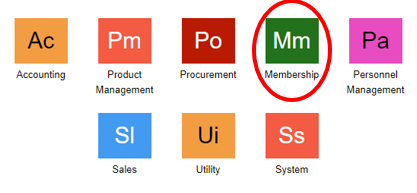
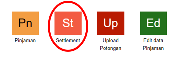
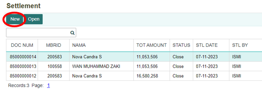
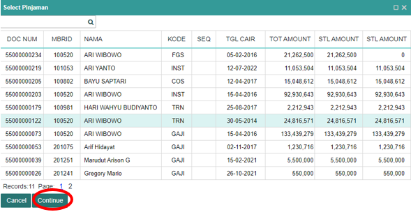
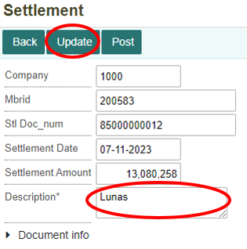
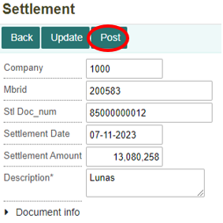
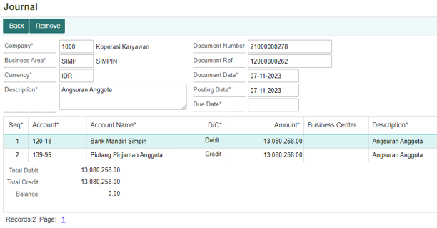
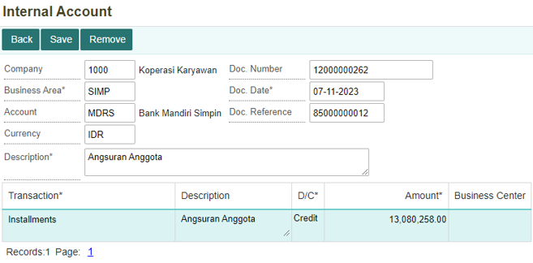

#  Langkah-langkah Melakukan Settlement

## Cara Menjalankan Menu Settlement

1.	Untuk menjalankan menu **Settlement**. Hal pertama adalah klik module **Membership** pada halaman utama.

    

2.	Setelah masuk kedalam module **Membership**, selanjutnya klik menu **Settlement**.

    

## Membuat Transaksi Settlement

1.	Untuk membuat transaksi settlement klik tombol **New** di menu **Settlement**.
    
    

2.	Maka akan ditampilkan data pinjaman anggota koperasi. Untuk melakukan pelunasan pilih data pinjaman yang akan dilakukan pelunasan, kemudian klik **Continue**.

    
 
3.	Setelah itu isi form Description untuk memberi keterangan pada transaksi pelunasan. Kemudian klik tombol **Update**.
 
     


```{note}
Semua kolom yang bertanda (*) wajib diisi
```

4.	Selanjutnya klik **Post** untuk data otomatis terbentuk dalam jurnal.

    
 
5.	Setelah berhasil melakukan **Post**, dokumen tersebut dapat dilihat di menu **Jurnal (JNL)**. Berikut dokumen Jurnal yang terbentuk.

    

6.	Selain Jurnal yang terbentuk, sistem juga otomatis membentuk dokumen **Internal Account**. Dokumen  tersebut dapat dilihat di menu **Internal Account (INCT**). Berikut dokumen yang terbentuk.

    
