# Membeli Aset Tetap (Fixed Asset)

## Pembelian Fixed Asset

Pembelian fixed asset merupakan pembelian barang untuk operasional sebuah bisnis atau perusahaan yang bersifat jangka panjang. Contoh barang fixed asset seperti furniture, elektronik, dan kendaraan. Pembelian barang fixed asset melewati beberapa tahap yaitu:

1. Membuat Dokumen Pembelian Fixed Asset
    Dokumen purchase order merupakan bukti pemesanan yang digunakan untuk menunjukkan barang yang akan dibeli kepada pihak penjual.

2. Penerimaan Barang Fixed Asset Melalui Product Transfer
    Penerimaan barang fixed aset dilakukan setelah dokumen PO telah disetujui oleh pihak penjual barang, maka akan diterima melalui product transfer.

3. Akuisisi Fixed Asset
    Akuisisi fixed asset merupakan pencatatan barang yang dilakukan setelah barang diterima kemudian akan diakusisi menjadi asset perusahaan. Pada transaksi akusisi fixed asset digunakan untuk melakukan proses depresiasi atau nilai penyusutan. Proses depresiasi dilakukan, karena penggunaan fixed asset secara terus menerus akan mengakibatkan penurunan kualitas, sehingga nilai dari fixed asset juga ikut menurun.

4. Pembayaran Pembelian Fixed Asset
    Setelah pesanan telah diterima dan sudah sesuai dengan pesanan, maka pembeli perlu melakukan pembayaran tersebut sesuai jangka waktu pembayaran yang telah disepakati oleh penjual dan pembeli, sehingga pembayaran dilakukan sebelum tanggal jatuh tempo pembayaran.

----

## Membuat Dokumen Pembelian Fixed Asset

1. Untuk membuat transaksi pembelian Fixed Asset dapat dilakukan di dalam menu **Purchase Order (PPO)** yang terdapat di dalam module **Procurement**.

    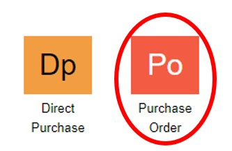

2. Kemudian untuk membuat dokumen PO yang baru, dapat dengan klik tombol **New**.

    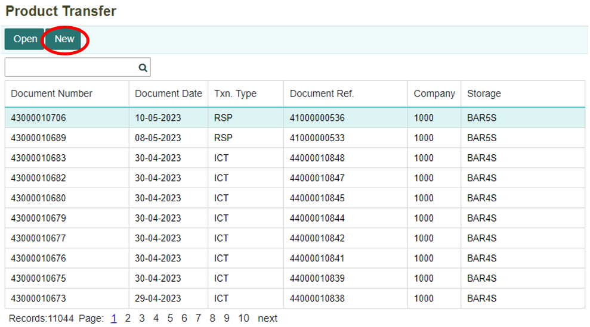

3. Setelah itu, akan ditampilkan form untuk membuat dokumen **PO**. Isi setiap kolom-kolom yang ada.

    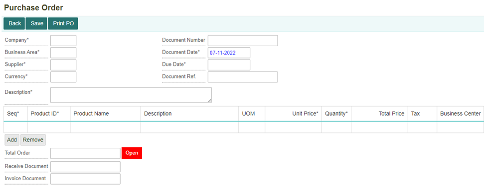

Tombol **Add** untuk memasukan barang-barang yang akan di pesan atau menambahkan record. Tombol **Remove** untuk menghapus barang dari daftar barang yang akan dibeli atau menghapus record.

```{note}  Semua kolom yang bertanda (*) wajib diisi
```


**Informasi Kolom:**

| No. | Kolom             | Keterangan                                        |
|----:|-------------------|---------------------------------------------------|
| 1   | Company           | Kode Perusahaan                                   |
| 2   | Business Area     | Kode Business Area                                |
| 3   | Supplier          | Kode Supplier                                    |
| 4   | Currency          | Mata Uang yang Digunakan                          |
| 5   | Document Number   | Nomor Dokumen                                    |
| 6   | Document Date     | Tanggal Pembuatan Dokumen                         |
| 7   | Due Date          | Tanggal Paling Lambat Penerimaan Barang           |
| 8   | Document Ref      | Nomor Dokumen Referensi                          |
| 9   | Description       | Keterangan                                       |
| 10  | Seq               | Nomor Urut                                       |
| 11  | Product ID        | Nomor Produk                                     |
| 12  | Product Name      | Nama Produk                                      |
| 13  | Unit of Measure    | Satuan Unit                                      |
| 14  | Unit Price         | Harga Produk                                     |
| 15  | Quantity           | Jumlah Produk                                    |
| 16  | Total Price        | Total Harga Belanjaan                            |
| 17  | Value Added Tax    | Pajak Pertambahan Nilai (PPN)                    |
| 18  | Business Center    | Tempat Bisnis Berlangsung                        |


 

4. Setelah form sudah diisi dengan lengkap, maka klik tombol **Save** untuk menyimpan transaksi. Kemudian akan muncul notifkasi bahwa data berhasil tersimpan.

    

    

## Penerimaan Barang Fixed Asset Melalui Product Transfer

1. Barang fixed asset yang sudah dipesan, akan dikirimkan oleh supplier. Setelah barang sampai dan telah diterima akan dimasukkan ke dalam Product Transfer, untuk membuat dokumen **Product Transfer** dapat dilakukan di dalam menu **Product Transfer (PRTS)** yang ada di dalam module **Product Management**.

    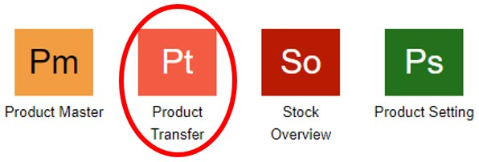

2. Kemudian akan ditampilkan daftar dokumen yang terdapat di dalam menu Product Transfer. Untuk membuat dokumen baru, klik tombol **New**.

    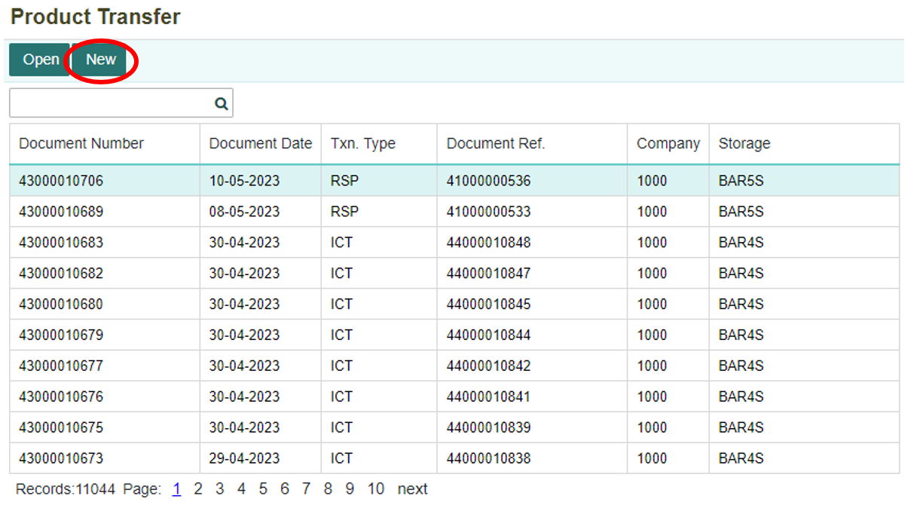

3. Kemudian akan muncul form pilihan tipe transaksi yang akan digunakan, untuk pembelian fixed asset menggunakan Receive from Supplier, selanjutnya klik **Next**.

    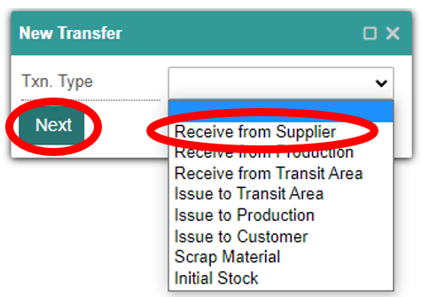

4. Isi kolom sesuai keterangan yang terdapat dalam kolom, kemudian pilih nomor PO sesuai nomor dokumen PO pembelian fixed asset tersebut. Maka akan tertera barang fixed asset yang dibeli. Kemudian setelah sudah terisi semua, maka klik tombol **Save**.

   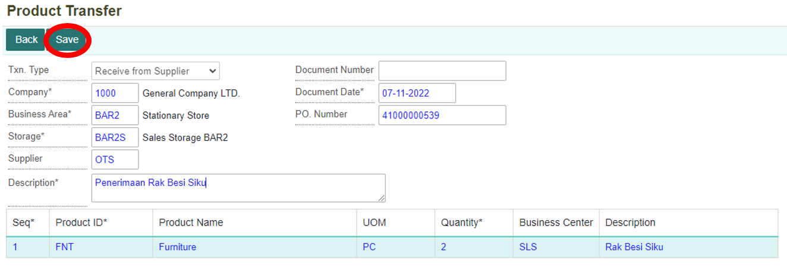

```{note}  Semua kolom yang bertanda (*) wajib diisi
```

**Informasi Kolom:** 

| No. | Field          | Keterangan                             |
|----:|----------------|----------------------------------------|
| 1   | Company        | Kode Perusahaan                        |
| 2   | Business Area  | Kode Business Area                     |
| 3   | Supplier       | Kode Supplier                          |
| 4   | Storage        | Tempat Penyimpanan Barang              |
| 5   | Currency       | Mata Uang Yang Digunakan                |
| 6   | Document Number | Nomor Dokumen                          |
| 7   | Document Date   | Tanggal Pembuatan Dokumen              |
| 8   | Description     | Keterangan Transaksi yang Dibuat       |
| 9   | PO Number       | Nomor PO yang Akan Digunakan           |

 

5. Setelah melakukan transaksi product transfer, maka akan terbentuk jurnal penerimaan barang dari product transfer. Berikut jurnal yang terbentuk dari dokumen product transfer.

      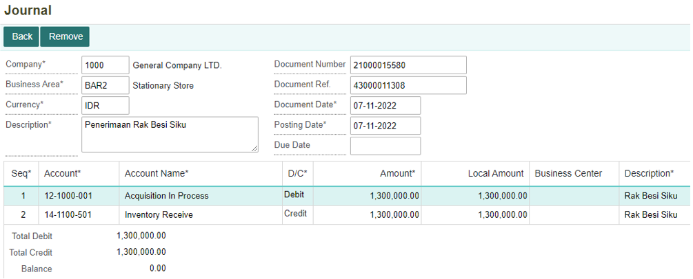

6. Kemudian kembali ke menu **Purchase Order (PPO)** untuk melakukan Post Payable. Klik tombol **Post Payable** untuk melakukan pembayaran.

    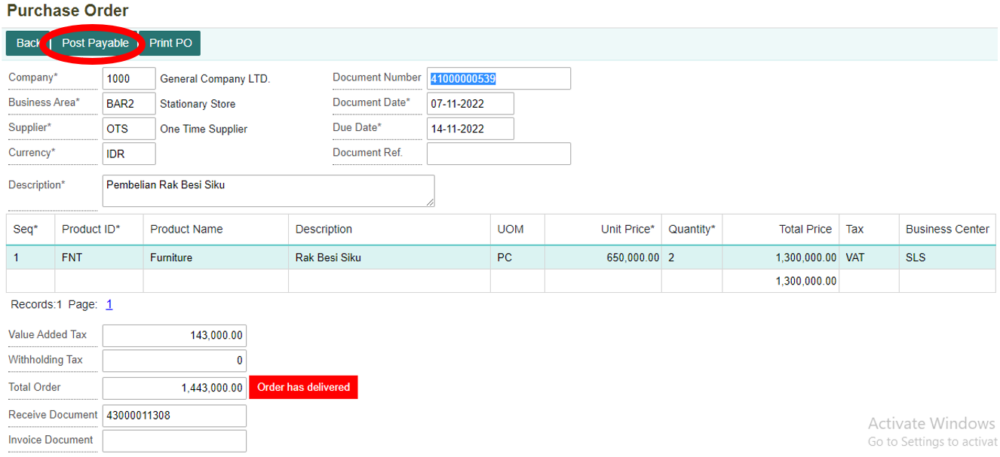

7. Maka akan muncul notifikasi konfirmasi untuk membuat AP. Apabila ingin **Post Payable**, klik tombol **OK**.

    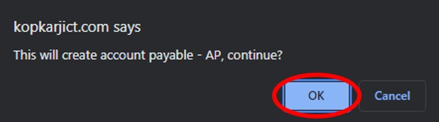

8. Apabila ingin membatalkan **Post Payable**, maka klik tombol **Cancel**.

    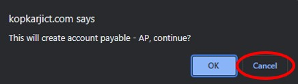

9. Setelah melakukan **Post Payable** pada **PO fixed asset**, maka akan terbentuk journal dari dokumen PO fixed asset. Berikut jurnal yang terbentuk dari **Post Payable** pada **PO fixed asset**.

   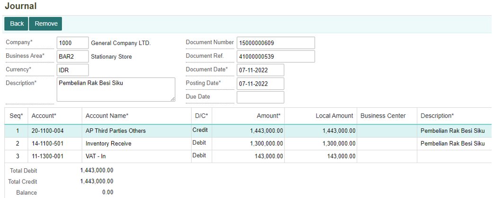

## Akuisisi Fixed Asset

1. Setelah barang sudah sampai dan diterima dari supplier, maka barang tersebut akan diakui sebagai asset. Hal ini dilakukan di dalam menu Fixed Asset yang terdapat pada module Accounting. Setelah masuk ke dalam module Accounting, klik menu **Fixed Asset (ASM)**.

    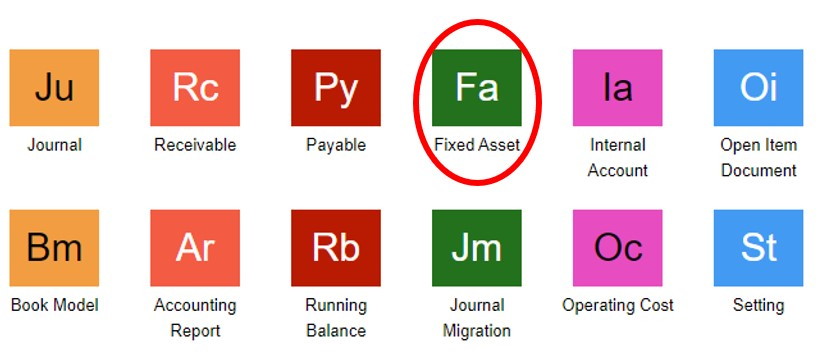

2. Kemudian akan ditampilkan menu **Fixed Asset**. Barang yang telah diterima harus diidentifikasi terlebih dahulu di dalam menu Fixed Asset. Dengan klik tombol **+** untuk menambahkan data fixed asset yang baru.

     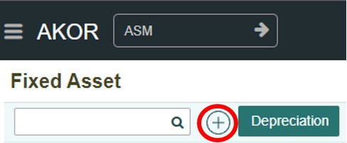

3. Setelah itu, akan ditampilkan form untuk menambahkan data fixed asset yang baru. Isi seluruh kolom-kolom yang ada. 

   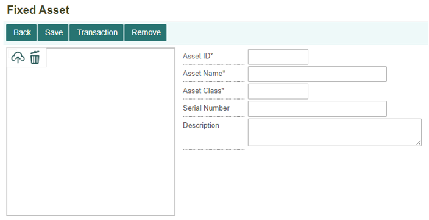


```{note}  Semua kolom yang bertanda (*) wajib diisi
```

Informasi Kolom: 

| No. | Field          | Keterangan                               |
|----:|----------------|------------------------------------------|
| 1   | Asset ID       | Kode Barang Aset                         |
| 2   | Asset Name     | Nama Barang Aset                         |
| 3   | Asset Class    | Jenis Barang Aset                        |
| 4   | Serial Number  | Keterangan Barang Aset                   |
| 5   | Description    | Keterangan Transaksi yang Dibuat         |

 

4. Klik tombol **Save** untuk menyimpan data fixed asset.

    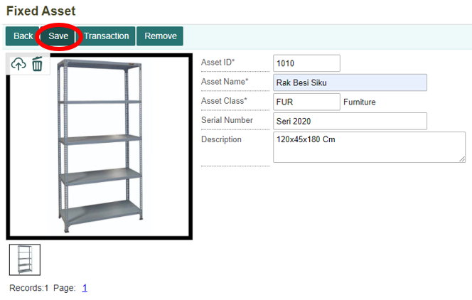

5. Setelah berhasil data disimpan, maka klik tombol **Transaction** untuk melakukan Akuisisi Fixed Asset.

    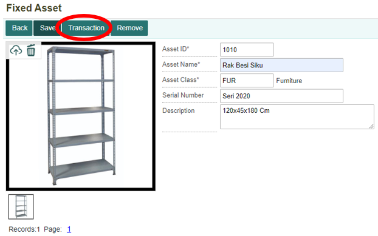

6. Kemudian klik tombol **New** untuk membuat transaksi baru.

    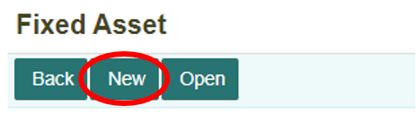

7. Maka akan tampil form untuk menambahkan transaksi baru. Pada bagian Txn. Type dipilih **Acquisition**.

     
    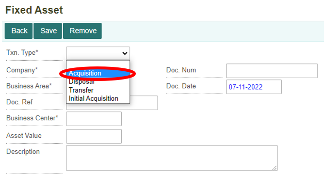

8. Lengkapi dan isi semua kolom-kolom yang ada, kemudian klik tombol **Save** maka data transaksi akuisisi fixed asset berhasil ditambahkan.

   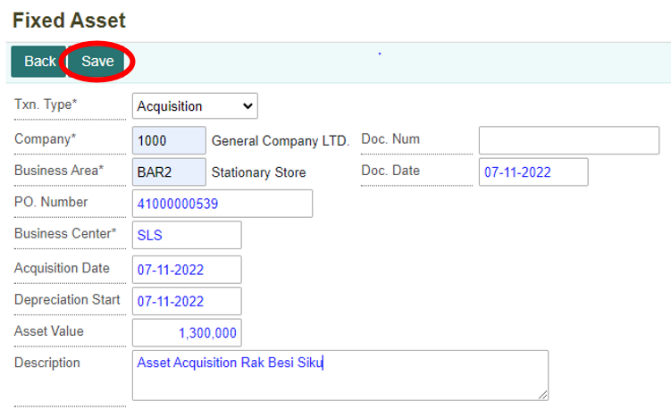

```{note}  Semua kolom yang bertanda (*) wajib diisi
```

**Informasi Kolom:**

| No. | Kolom                | Keterangan                                            |
|----:|----------------------|-------------------------------------------------------|
| 1   | Txn. Type            | Jenis Transaksi yang Dilakukan                       |
| 2   | Company              | Kode Perusahaan                                       |
| 3   | Business Area        | Kode Area Bisnis                                      |
| 4   | PO. Number           | Nomor Dokumen Purchase Order                          |
| 5   | Business Center      | Kode Tempat Bisnis Berlangsung                        |
| 6   | Acquisition Date     | Tanggal Dilakukan Akuisisi                            |
| 7   | Depreciation Start   | Tanggal Dimulai Depresiasi Barang Fixed Asset Tersebut|
| 8   | Asset Value           | Nilai Asset (Harga Barang Asset)                       |
| 9   | Description           | Keterangan Transaksi                                  |
| 10  | Doc. Num              | Nomor Dokumen Transaksi                               |
| 11  | Doc. Date             | Tanggal Pembuatan Dokumen Transaksi                    |


## Pembayaran Pembelian Fixed Asset

1. Untuk melakukan pembayaran hutang (AP) pembelian fixed asset, maka dapat dilakukan di dalam menu Payable di module Accounting. Klik menu **Payable (PBL)**.

     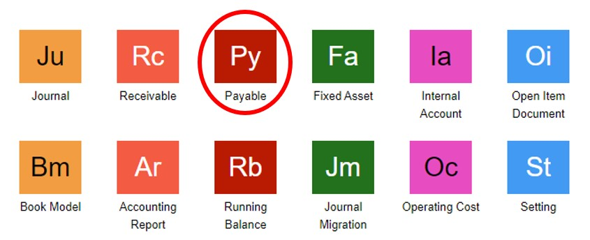

2. Kemudian akan ditampilkan daftar dokumen-dokumen yang terdapat pada menu **Payable**.

    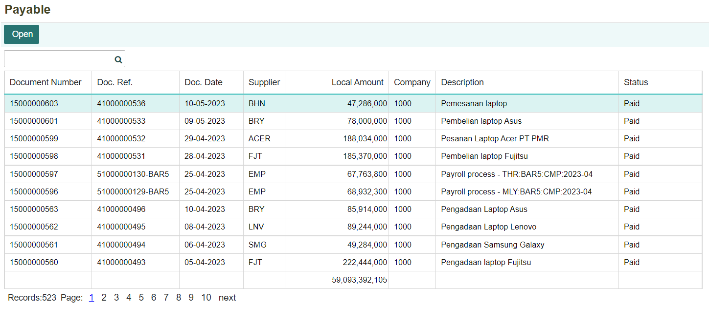

3. Setelah melakukan **Post Payable**, invoice akan terbentuk otomatis ke dalam Payable. Untuk mencari invoice yang akan dibayar, dengan mencari di kolom pencarian nomor dokumen PO. Kemudian klik tombol **Open**.

    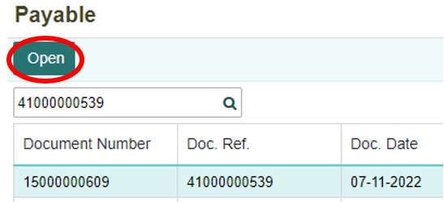

4. Berikut dokumen payable yang terbentuk dan status masih **“Unpaid”**, kemudian klik tombol **Payment** untuk melakukan pembayaran.

   
    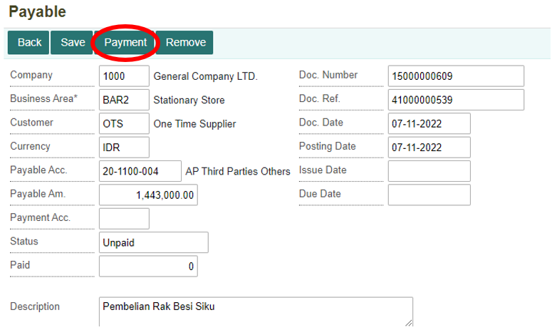

5. Selanjutnya pilih akun pembayaran yang akan digunakan di kolom **Payment Acc**. Dan juga atur tanggal sesuai tanggal pembayaran.

     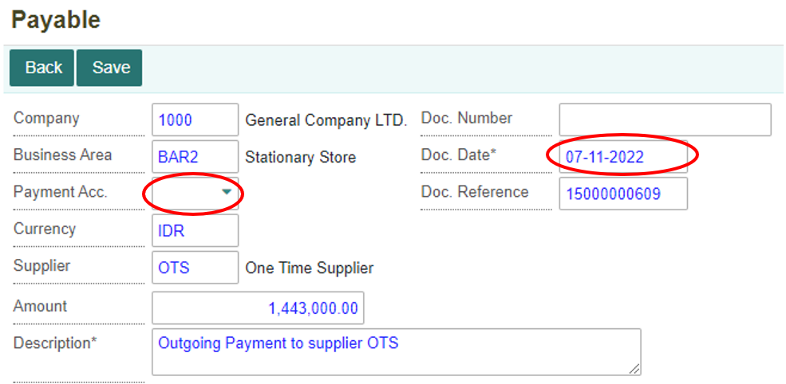

6. Setelah selesai mengisi form untuk pembayaran, selanjutnya klik tombol **Save** untuk menyetujui pembayaran.

    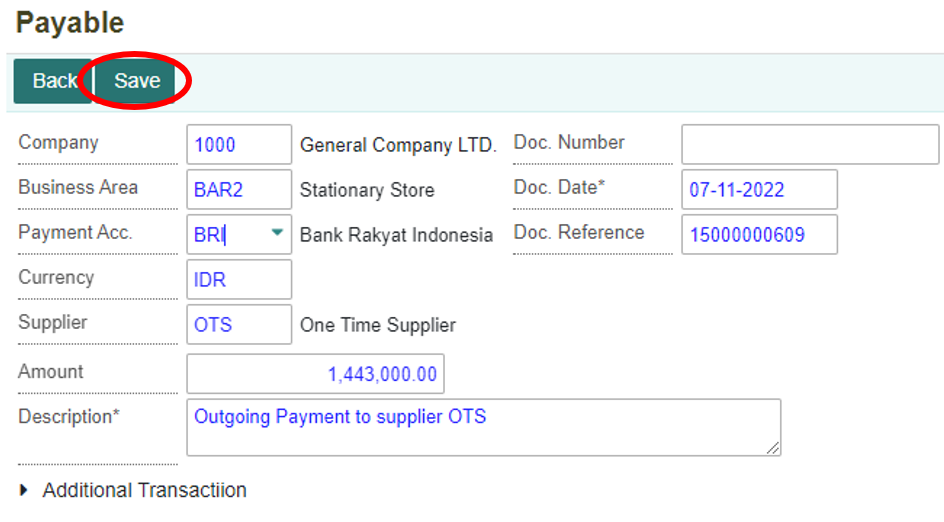

7. Maka statusnya akan berubah menjadi **“Paid”**

    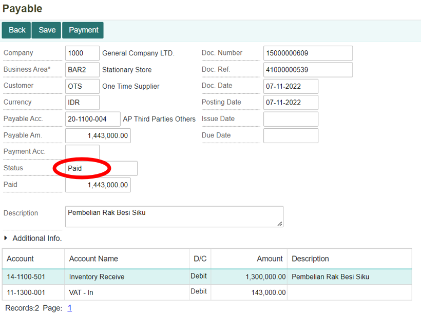

8. Setelah melakukan pembayaran pada menu **Payable**, maka akan terbentuk jurnal dari pembayaran yang telah dilakukan. Berikut jurnal yang terbentuk setelah melakukan pembayaran.

    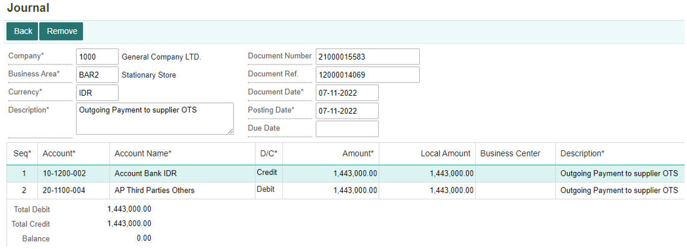

 


```{tableofcontents}
```
