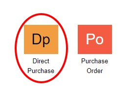
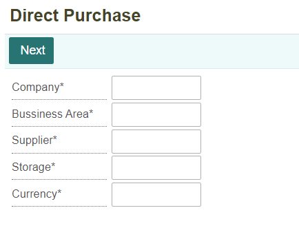
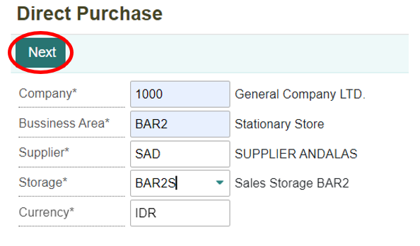
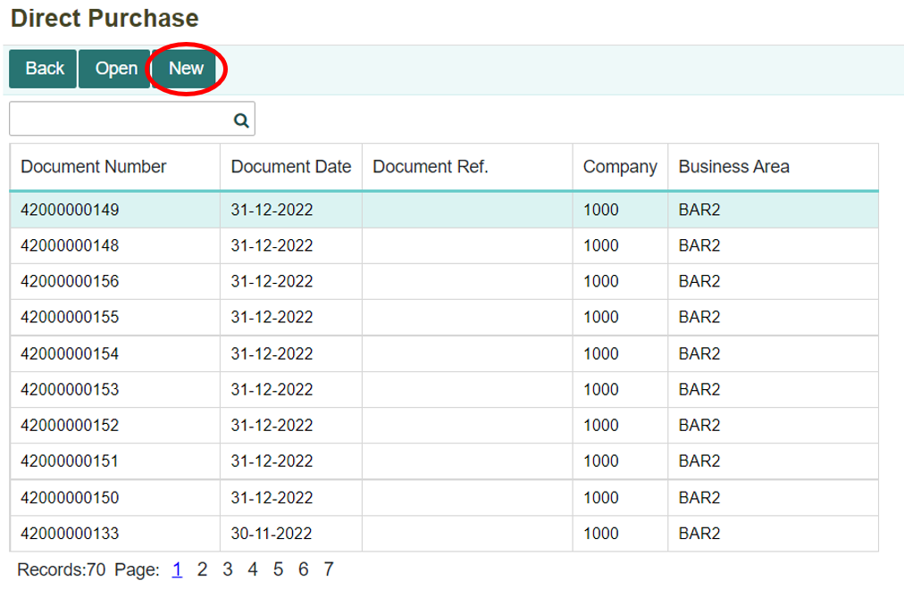
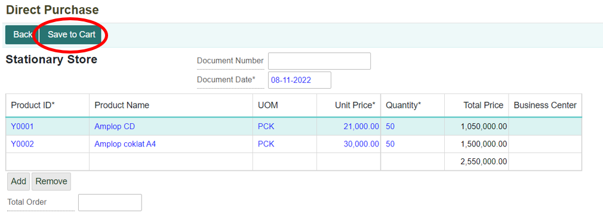
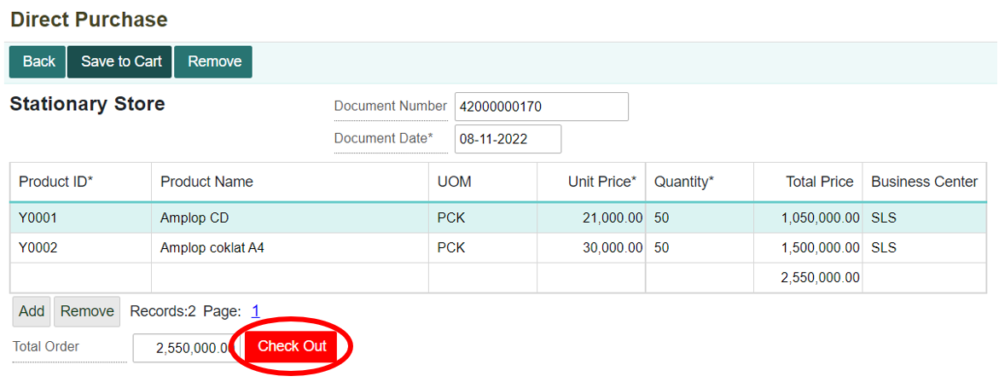
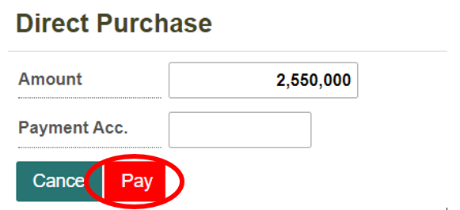
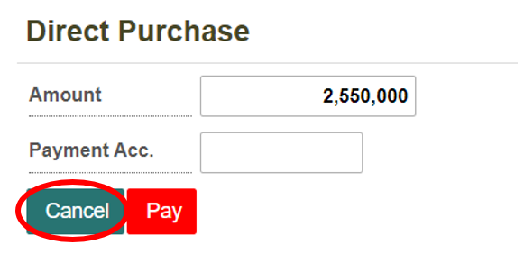
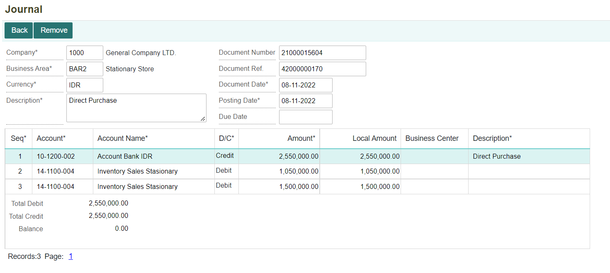
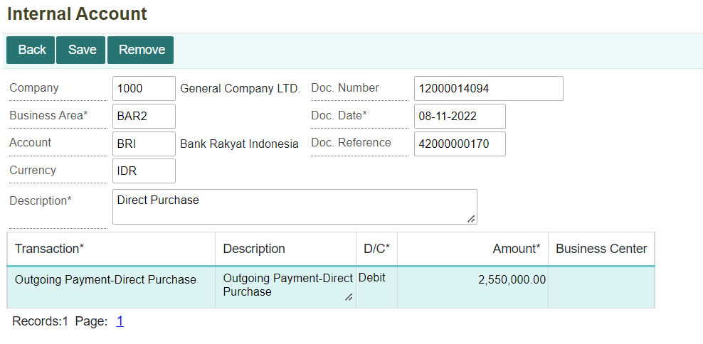

# Melakukan Pembelian Langsung

## Pembelian Langsung
Pembelian langsung merupakan transaksi pengadaan barang yang dilakukan secara langsung tanpa melakukan pemesanan barang dan barang langsung dibayarkan. Dalam hal ini, pihak penjual akan membuat dokumen pembelian barang dapat dilakukan di menu Direct Purchase. Di dalam dokumen tersebut akan terdapat mengenai daftar barang yang dibeli berserta harga dan total belanjaan dan metode pembayaran yang digunakan.

---

# Membuat Dokumen Pembelian Direct Purchase

1. Untuk membuat transaksi pembelian langsung dapat dilakukan di dalam menu Direct Purchase (DPU) yang terdapat di dalam module **Procurement**.

    

2. Kemudian akan ditampilkan form untuk melakukan **Direct Purchase**.

    

3. Isi dan lengkapi setiap kolom, selanjutnya klik tombol **Next**.

    


    ```{note} Semua kolom yang bertanda (*) wajib diisi
    ```


Informasi Kolom:

| No. | Kolom             | Keterangan                        |
|-----|-------------------|-----------------------------------|
| 1   | Company           | Kode Perusahaan                   |
| 2   | Business Area     | Kode Area Bisnis                  |
| 3   | Supplier          | Kode Supplier Penyedia Barang     |
| 4   | Storage           | Tempat Penyimpanan Barang         |
| 5   | Currency          | Mata Uang yang Digunakan          |

    

4. Maka akan ditampilkan daftar transaksi direct purchase yang telah dilakukan sebelumnya. Untuk membuat dokumen Direct Purchase baru, klik tombol **New**.

    


5. Akan ditampilkan form untuk melakukan transaksi pembelian direct purchase. Isi dan lengkapi setiap kolom-kolom yang ada, setelah itu klik tombol **Save to Cart** untuk menyimpan data transaksi tersebut.

    


Tombol **Add** untuk menambahkan record (menambahkan barang yang dibeli). Sedangkan tombol **Remove** untuk menghapus record (barang yang sudah dimasukkan).

```{note} Semua kolom yang bertanda (*) wajib diisi
```


6. Setelah melakukan Save to Cart, maka sistem akan otomatis memperhitungkan dan menampilkan total harga yang harus dibayarkan (Total Order). Kemudian klik tombol **Check Out** untuk melakukan pembayaran.

    


**Informasi Kolom:**

| No. | Kolom            | Keterangan                        |
|-----|------------------|-----------------------------------|
| 1   | Document Number  | Nomor Dokumen Direct Purchase      |
| 2   | Document Date    | Tanggal Dokumen Dibuat             |
| 3   | Product ID       | Kode Produk (Barang)              |
| 4   | Product Name     | Nama Produk                       |
| 5   | UOM              | Satuan Barang                     |
| 6   | Unit Price       | Harga Barang Satuan               |
| 7   | Quantity         | Jumlah Barang yang Dibeli         |
| 8   | Total Price      | Total Harga Barang                 |
| 9   | Business Center  | Kode Tempat Bisnis Berlangsung     |
| 10  | Total Order      | Total Belanjaan Keseluruhan       |

 

7. Selanjutnya akan ditampilkan form untuk melakukan pembayaran. Pada tahap ini, metode pembayaran dapat disesuaikan dengan keinginan. Pilih metode pembayaran (Payment Acc.) yang ingin digunakan. Setelah itu, klik tombol **Pay** untuk melanjutkan pembayaran. Maka akan tampil notifikasi bahwa pembayaran berhasil.

    


8. Apabila tidak ingin melanjutkan ke pembayaran, maka klik tombol **Cancel**.

    


## Jurnal dan Dokumen yang Terbentuk

1. Ketika melakukan transaksi direct purchase maka akan terbentuk juga **Journal (JNL)** secara otomatis. Berikut jurnal yang terbentuk dari transaksi tersebut:

    


2. Tidak hanya jurnal yang otomatis terbentuk, tetapi juga dokumen pada *Internal Account (INCT)*. Berikut dokumen internal account yang terbentuk dari transaksi tersebut:

    


