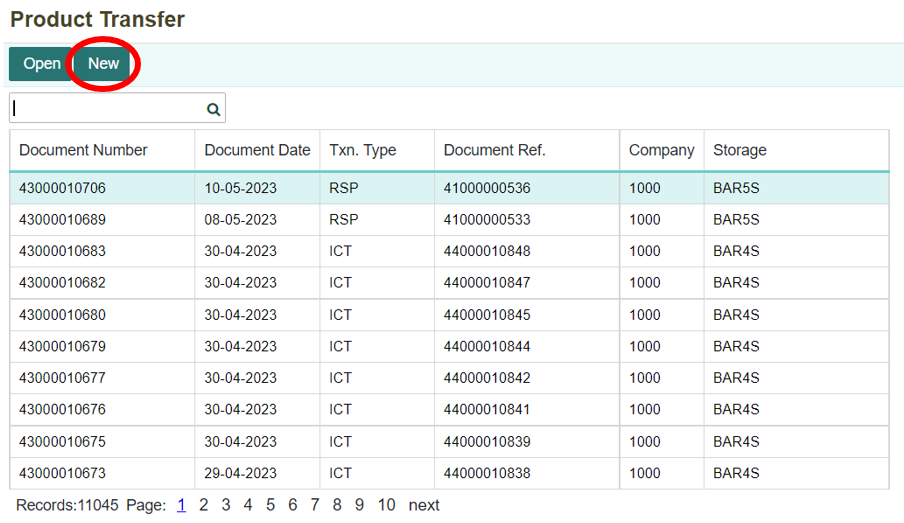

# Melakukan Pembelian Melalui PO (Pre-Order)

## Pembelian Melalui Purchase Order (PO)
Pembelian melalui PO merupakan transaksi yang dilakukan baik untuk membeli peralatan (fixed asset) atau barang dagang. Dalam hal ini pihak perusahaan akan mencari supplier yang akan diajak bekerjasama, kemudian membuat dokumen Purchase Order sebagai dokumen pemesanan barang. Di dalam dokumen tersebut akan tertera daftar barang yang dipesan kepada supplier dan harganya. Kemudian setelah membuat dokumen Purchase Order, maka dokumen PO akan diterima oleh pihak supplier dan pihak supplier akan mengirimkan barang sesuai dengan yang tertera di dokumen Purchase Order. Setelah barang sudah diterima, maka perlu membuat dokumen Product Transfer untuk mengkonfirmasi pihak supplier bahwa barang yang dikirimkan sudah sesuai pesanan dan tidak terdapat kerusakan. Maka setelah itu, melakukan post payable untuk membentuk AP (hutang). Kemudian untuk melakukan pembayaran transaksi Purchase Order dapat dilakukan di menu Payable.

## Membuat Dokumen Purchase Order
1. Untuk membuat dokumen Purchase Order dilakukan di dalam menu Purchase Order yang terdapat pada module Procurement. Klik menu Purchase Order (PPO).

    

2. Kemudian akan ditampilkan daftar dari transaksi-transaksi yang telah dilakukan. Klik tombol **New** untuk membuat dokumen Purchase Order yang baru.

    

3. Maka akan ditampilkan form untuk membuat dokumen Purchase Order yang baru. 

    

4. Isi dan lengkapi setiap kolom-kolom yang ada, kemudian klik tombol **Save** untuk menyimpan data atau dokumen yang dibuat.

        

Tombol **Add** untuk menambahkan record (menambahkan barang yang dibeli). Sedangkan tombol **Remove** untuk menghapus record (barang yang sudah dimasukkan).

```{note}  Semua kolom yang bertanda (*) wajib diisi
```


5. Kemudian sistem akan otomatis menghitung total **PPN** yang harus dibayarkan dan juga total belanjaan **keseluruhan + PPN**. 

    
 

**Informasi Kolom:**

| No. | Kolom               | Keterangan                                   |
|----:|---------------------|----------------------------------------------|
| 1   | Company             | Kode Perusahaan                              |
| 2   | Business Area       | Kode Area Bisnis                             |
| 3   | Supplier            | Kode Supplier                                |
| 4   | Currency            | Mata Uang yang Digunakan                     |
| 5   | Document Number     | Nomor Dokumen Purchase Order                 |
| 6   | Document Date       | Tanggal Pembuatan Dokumen                    |
| 7   | Due Date             | Tanggal Paling Lambat Penerimaan Barang      |
| 8   | Document Ref         | Nomor Dokumen Referensi                      |
| 9   | Description          | Keterangan                                   |
| 10  | Seq                 | Nomor Urut                                   |
| 11  | Product ID           | Nomor Produk                                 |
| 12  | Product Name         | Nama Produk                                  |
| 13  | Unit of Measure      | Satuan Unit                                  |
| 14  | Unit Price           | Harga Produk                                 |
| 15  | Quantity             | Jumlah Produk                                |
| 16  | Total Price          | Total Harga Belanjaan                        |
| 17  | Tax                  | Jenis Pajak yang Digunakan                   |
| 18  | Business Center      | Tempat Bisnis Berlangsung                    |
| 19  | Value Added Tax (VAT)| Pajak Pertambahan Nilai (PPN)                |
| 20  | Total Order          | Total Harga Belanjaan (Keseluruhan Harga Barang + PPN) |


## Membuat Dokumen Product Transfer

1. Setelah membuat dokumen **Purchase Order**, maka barang akan dikirimkan dari supplier. Dalam hal ini, perlu membuat dokumen Product Transfer untuk bukti bahwa barang sudah diterima dari supplier dan sesuai dengan pesanan. Untuk membuat dokumen Produk Transfer, dapat dilakukan di dalam menu **Product Transfer** yang terdapat pada module Product Management. Klik menu **Product Transfer (PRTS)**.

     

2. Maka akan ditampilkan daftar dokumen yang terdapat di menu **Product Transfer**. Untuk membuat dokumen Product Transfer yang baru, dengan klik tombol **New**.

    

3. Setelah itu pilih tipe transaksi yang akan dilakukan. Pilih **“Receive From Supplier”** karena akan mengirimkan barang kepada customer dan klik tombol **Next**.

    

4. Kemudian akan ditampilkan form, isi setiap kolom yang ada. Kemudian masukan nomor dokumen PO dan tanggal disesuaikan dengan tanggal pada saat menerima barang. Setelah itu, klik tombol **Save**.

    

```{note} Semua kolom yang bertanda (*) wajib diisi
``` 

Informasi Kolom:

| No. | Kolom              | Keterangan                                    |
|----:|--------------------|-----------------------------------------------|
| 1   | Txn. Type          | Tipe Transaksi yang Dilakukan                 |
| 2   | Company            | Kode Perusahaan                               |
| 3   | Business Area      | Kode Area Bisnis                              |
| 4   | Storage            | Tempat Penyimpanan yang Digunakan             |
| 5   | Supplier           | Kode Supplier Penyedia Barang                 |
| 6   | Description        | Keterangan                                   |
| 7   | Document Number    | Nomor Dokumen Product Transfer                |
| 8   | Document Date      | Tanggal Pembuatan Dokumen                     |
| 9   | PO. Number         | Nomor Dokumen Purchase Order                  |
| 10  | Seq                | Nomor Urut Record                             |
| 11  | Product ID         | Kode Produk atau Barang                       |
| 12  | Product Name       | Nama Produk                                  |
| 13  | UOM                | Satuan Barang                                 |
| 14  | Unit Price         | Harga Barang Satuan                           |
| 15  | Quantity           | Jumlah Banyaknya Barang                       |
| 16  | Business Center    | Kode Tempat Bisnis Berlangsung                |

 

5.Setelah data sudah berhasil disimpan. Maka akan terbentuk jurnal dari proses Product Transfer. Jurnal tersebut dapat dilihat melalui menu Journal yang terdapat pada module **Accounting**. Berikut jurnal yang terbentuk setelah Product Transfer.

 

6. Setelah itu, kembali lagi ke menu **Purchase Order** untuk melakukan **Post Payable**. Buka kembali dokumen Sales Order yang sudah dibuat, kemudian klik tombol **Post Payable**. Dan status sudah berubah menjadi “Order has Delivered”

    

7. Kemudian akan muncul notifikasi konfirmasi untuk membentuk AP (hutang). Klik tombol **OK** apabila setuju dan ingin melanjutkan.

    

8. Apabila ingin membatalkan, maka klik tombol **Cancel**.

    

9. Setelah melakukan Post Payable, jurnal akan otomatis terbentuk seperti berikut:

    

## Melakukan Pembayaran untuk Transaksi Purchase Order
1.  Sesudah melakukan Post Payable, maka dokumen AP akan otomatis terbentuk di menu Payable. Untuk melakukan pembayaran, dapat dilakukan di dalam menu Payable yang terdapat pada module Accounting. Klik menu **Payable (PBL)**.

    

2. Maka akan ditampilkan daftar transaksi pembelian yang sudah dilakukan sebelumnya. 

    

3. Untuk mempermudah pencarian dokumen Payable untuk transaksi Purchase Order yang dilakukan, dapat dengan cara melakukan pencarian nomor dokumen Purchase Order di kolom pencarian. Kemudian klik tombol **Open** untuk membuka dokumen.

    

4. Kemudian akan ditampilkan dokumen Payable. Setelah itu, klik tombol **Payment** untuk melakukan pembayaran. Status masih “Unpaid”.

    

5. Selanjutnya pilih akun pembayaran yang akan digunakan di kolom Payment Acc. Dan juga atur tanggal sesuai tanggal pembayaran. Kemudian klik tombol **Save**.

    

6. Maka pembayaran berhasil dilakukan, status akan berubah menjadi **“Paid”**.

    

7. Transaksi pembayaran PO akan membentuk dokumen di Internal Account secara otomatis.

    

8. Selain itu, terbentuk juga jurnal secara otomatis.

    


```{tableofcontents}
```
