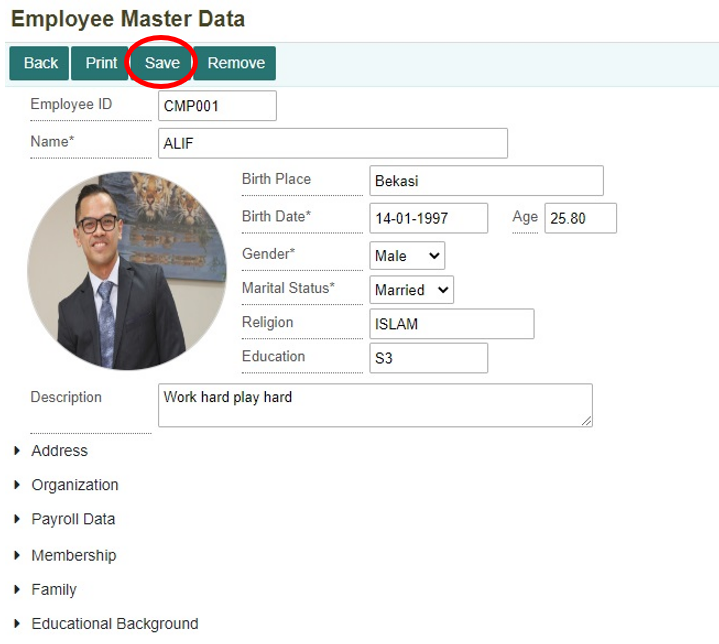

# Melakukan Penggajian Karyawan

## Penggajian Karyawan

Pada suatu perusahaan atau suatu usaha bisnis, terdapat karyawan yang bekerja. Dalam hal ini perlu adanya komponen penggajian karyawan. Sebelum melakukan proses penggajian hal pertama yang perlu adalah pendaftaran data karyawan yang dapat dilakukan di dalam menu Employee Master Data. Setelah itu, baru dapat melakukan proses penggajian karyawan di dalam menu Payroll Process. Tahap ini akan menjelaskan dari mulai tahap membuat data karyawan, proses penggajian karyawan, sampai pembayaran gaji karyawan.

---

## Membuat Data Karyawan

1. Sebelum melakukan proses penggajian perlu mendaftarkan data karyawan pada menu **Employee Master Data** yang terdapat di dalam module **Personnel Management**. Klik menu **Employee Master Data**.

    

2. Selanjutnya untuk menambahkan data karyawan klik ikon pada gambar di bawah ini.

    

3. Maka akan ditampilkan form untuk menambahkan data karyawan baru. Isi dan lengkapi setiap kolom yang ada. Untuk form employee master data memiliki tujuh komponen penting yang perlu diisi.

### * **Personal Data**


```{note} * Semua kolom yang bertanda (*) wajib diisi
		  * Untuk kolom age akan terisi secara otomatis
```
 

Informasi Kolom:

| No. | Kolom         | Keterangan                          |
|-----|---------------|-------------------------------------|
| 1   | Company       | Kode Perusahaan                     |
| 2   | Employee ID   | Kode Karyawan                       |
| 3   | Name          | Nama Pegawai                        |
| 4   | Birth Place   | Tempat Lahir                        |
| 5   | Birth Date    | Tanggal Lahir                       |
| 6   | Age           | Usia Karyawan                       |
| 7   | Gender        | Jenis Kelamin Karyawan               |
| 8   | Martial Status| Status Pernikahan Karyawan           |
| 9   | Religion      | Agama Karyawan                       |
| 10  | Education     | Pendidikan Terakhir Karyawan         |
| 11  | Description   | Keterangan Alamat                   |


### * **Address**


Informasi Kolom:

| No. | Kolom              | Keterangan                                |
|-----|--------------------|-------------------------------------------|
| 1   | Address            | Alamat Karyawan                           |
| 2   | Phone              | Nomor Telepon Karyawan                    |
| 3   | Email              | Alamat Email Karyawan                     |
| 4   | Emergency Address  | Alamat/Kontak Darurat Karyawan             |

```{note} Semua kolom yang bertanda (*) wajib diisi
```

### * **Organization**


Informasi Kolom:

| No. | Kolom         | Keterangan                           |
|-----|---------------|--------------------------------------|
| 1   | Begin         | Tanggal Mulai Bekerja Karyawan        |
| 2   | Last          | Tanggal Terakhir Bekerja Karyawan     |
| 3   | Area          | Kode Tempat Bekerja Karyawan           |
| 4   | Group         | Kelompok Karyawan                     |
| 5   | Unit          | Unit Pekerjaan Karyawan               |
| 6   | Status        | Status Karyawan                       |
| 7   | Term Eff.     | -                                    |
| 8   | Job           | Pekerjaan Karyawan                    |
| 9   | Position      | Jabatan Karyawan                      |
| 10  | Grade         | Golongan Karyawan                     |

```{note} Semua kolom yang bertanda (*) wajib diisi
```

### * **Payroll Data**


```{note} Semua kolom yang bertanda (*) wajib diisi
```

Informasi Kolom:

| No. | Kolom           | Keterangan                              |
|-----|-----------------|-----------------------------------------|
| 1   | Payroll Area    | Kode Area Penggajian                    |
| 2   | Business Area   | Kode Area Bisnis                        |
| 3   | Business Center | Kode Tempat Bisnis Berlangsung           |
| 4   | Bank            | Nama Bank Karyawan                      |
| 5   | Payee           | Nama Pemilik Rekening                   |
| 6   | Bank Account    | Nomor Rekening Karyawan                 |


### * **Membership**


Tombol **Add** untuk menambahkan *record* (kolom) baru. Sedangkan tombol **Remove** untuk menghapus *record* (kolom).
 
Informasi Kolom :

| No. | Kolom            | Keterangan                  |
|-----|------------------|-----------------------------|
| 1   | Code             | Kode Membership            |
| 2   | Membership Name  | Nama Membership            |
| 3   | Begin Eff.       | Tanggal Mulai              |
| 4   | Last Eff.        | Tanggal Berakhir           |
| 5   | Description      | Keterangan                  |
| 6   | Member ID        | Nomor Member Karyawan       |


### * **Family**


Tombol **Add** untuk menambahkan *record* (kolom) baru. Sedangkan tombol **Remove** untuk menghapus *record* (kolom).

```{note} Semua kolom yang bertanda (*) wajib diisi
```

**Informasi Kolom:**

| No. | Kolom         | Keterangan                 |
|-----|---------------|----------------------------|
| 1   | Seq           | Nomor Urut                 |
| 2   | Name          | Nama                       |
| 3   | Gender        | Jenis Kelamin              |
| 4   | Rel Type      | Hubungan dengan Karyawan    |
| 5   | Birth Date    | Tanggal Lahir              |
| 6   | Martial Status| Status Pernikahan           |

### * **Educational Background**


Tombol **Add** untuk menambahkan *record* (kolom) baru. Sedangkan tombol **Remove** untuk menghapus *record* (kolom).

 
**Informasi Kolom:**
 

| No. | Kolom             | Keterangan                   |
|-----|-------------------|------------------------------|
| 1   | Seq               | Nomor Urut                   |
| 2   | Education Name    | Nama Pendidikan              |
| 3   | Degree            | Gelar Karyawan                |
| 4   | Major             | Fakultas                      |
| 5   | Minor             | Program Studi                 |
| 6   | G.P.A             | IPK / Nilai Karyawan          |
| 7   | Graduation Date   | Tanggal Kelulusan            |
| 8   | Predicate         | Predikat Nilai Karyawan       |
| 9   | Description       | Keterangan                    |

 

4. Setelah semua sudah dilengkapi, selanjutnya klik tombol **Save**. Maka akan tampil notifikasi bahwa data berhasil terima.

    

5. Kemudian di bagian **Payroll Data**, akan muncul tombol baru, yaitu **Payroll Detail**. Klik tombol **Payroll Detail**.

    

6. Maka akan ditampilkan form baru untuk membuat **Payroll Component**. Isi setiap kolom yang ada. Setelah itu, klik tombol **Save*.                

    

Tombol **Add**untuk menambahkan *record* (kolom) baru. Sedangkan tombol **Remove** untuk menghapus *record* (kolom).

```{note} Semua kolom yang bertanda (*) wajib diisi
```

**Informasi Kolom:**
 
| No. | Kolom           | Keterangan                              |
|-----|-----------------|-----------------------------------------|
| 1   | Company         | Kode Perusahaan                         |
| 2   | Employee ID     | Kode Karyawan                           |
| 3   | Tax Type        | Tipe Pajak Karyawan                     |
| 4   | Tanggungan      | Tanggungan Karyawan                     |
| 5   | NPWP            | Nomor NPWP Karyawan                     |
| 6   | Component       | Kode Komponen Gaji                      |
| 7   | Component Name  | Nama Komponen Gaji                      |
| 8   | Start Period    | Tanggal Mulai Periode Komponen          |
| 9   | End Period      | Tanggal Akhir Periode Komponen          |
| 10  | Currency        | Mata Uang yang Digunakan                |
| 11  | Amount          | Jumlah / Nilai Komponen                 |
| 12  | Com.Info        | Info Komponen                           |
| 13  | Description      | Keterangan                              |


## Membuat Dokumen Penggajian Karyawan

1. Setelah mendaftarkan karyawan selanjutnya melakukan proses penggajian karyawan yang dapat dilakukan di dalam menu **Payroll Process** yang terdapat di dalam module Personnel Management. Klik menu **Payroll Process (PAY)**.

    

2. Maka akan ditampilkan daftar dokumen-dokumen penggajian karyawan yang telah dilakukan sebelumnya. Klik tombol **New** untuk membuat dokumen penggajian karyawan yang baru.

    

3. Selanjutnya akan ditampilkan form **New Process**. Isi dan lengkapi setiap kolom, kemudian klik tombol **Process** untuk memproses atau membentuk dokumen penggajian karyawan yang baru.

	

```{note} Semua kolom yang bertanda (*) wajib diisi
```
 


**Informasi Kolom:**

| No. | Kolom          | Keterangan                              |
|-----|----------------|-----------------------------------------|
| 1   | Payroll Type   | Tipe Penggajian                         |
| 2   | Company        | Kode Perusahaan                         |
| 3   | Payroll Area   | Kode Area Bisnis untuk Penggajian      |
| 4   | Period         | Periode Penggajian (Tahun-Bulan)        |
| 5   | Process Date   | Tanggal Proses Penggajian               |

 

4. Setelah itu akan muncul notifikasi konfirmasi untuk melanjutkan proses penggajian, klik **OK** untuk melanjutkan proses penggajian karyawan.

    

5. Apabila ingin membatalkan proses penggajian karyawan, klik tombol **Cancel**.

    

6. Maka data penggajian akan otomatis masuk ke daftar dokumen penggajian. Selanjutnya, untuk membuka dokumen penggajian karyawan yang baru dibuat klik tombol **Open**.

    

7. Untuk dapat melakukan pembayaran gaji karyawan, klik tombol **Post Payable** untuk membentuk dokumen pembayaran di menu **Payable**.

    

8. Maka akan tampil notifikasi konfirmasi untuk melakukan **Post Payable**, apabila tetap ingin melanjutkan klik tombol **OK**.

    

9. Apabila ingin membatalkan, maka klik tombol Cancel.

    

10. Setelah melakukan Post Payable, jurnal untuk transaksi penggajian karyawan akan terbentuk secara otomatis. Jurnal tersebut dapat dilihat di menu **Journal (JNL)** yang terdapat pada module Accounting. Berikut jurnal yang terbentuk.

    

## Melakukan Pembayaran Penggajian Karyawan

1. Untuk melakukan pembayaran gaji karyawan dengan klik menu **Payable (PBL)** yang terdapat pada module Accounting.

    

2. Maka akan ditampilkan daftar dokumen transaksi di menu **Payable**.

    

3. Untuk memudahkan pencarian dokumen penggajian karyawan yang sudah dibuat, dapat melakukan pencarian nomor dokumen penggajian karyawan pada kolom pencarian. Setelah itu, klik tombol **Open** untuk membuka dokumen tersebut.

    

4. Dokumen yang telah dibuka masih berstatus **“Unpaid”** maka untuk melakukan pembayaran klik tombol **Payment**.

    

5. Selanjutnya pilih akun pembayaran yang akan digunakan di kolom Payment Acc. Dan juga atur tanggal sesuai tanggal pembayaran. Kemudian klik tombol Save untuk menyimpan data transaksi.

    

6. Maka status pembayaran akan berubah menjadi **“Paid”**

    

7. Setelah berhasil melakukan pembayaran maka akan terbentuk dokumen di Internal Account secara otomatis. Dokumen tersebut dapat dilihat di menu **Internal Account (INCT)**. Berikut dokumen Internal Account yang terbentuk.

    

8. Selain dokumen Internal Account yang terbentuk, sistem juga otomatis membentuk jurnal. Jurnal tersebut dapat dilihat di menu **Journal (JNL)**. Berikut jurnal yang terbentuk.

    


```{tableofcontents}
```
