# Melakukan Transaksi Penjualan Melalui SO

## Transaksi Penjualan Melalui SO

Transaksi penjualan melalui SO merupakan transaksi yang dilakukan secara tidak langsung. Customer akan berhubungan langsung dengan sales mengenai ketersediaan barang yang dibutuhkan serta harganya. 

Setelah itu, customer akan melakukan pemesanan barang kepada sales, sehingga sales perlu membuat dokumen pemesanan barang di dalam Sales Order. Kemudian barang pesanan customer akan segera dikemas dan dikirimkan, maka perlu dilakukannya pembuatan dokumen Product Transfer. Maka customer akan menerima barang dan apabila sudah sesuai dengan pesanan dan tidak ada kerusakan, selanjutnya customer akan melakukan pembayaran di Receivable.

---

## Membuat Dokumen Sales Order
1. Untuk membuat dokumen **Sales Order** sesuai dengan permintaan dan pesanan customer dapat dilakukan di dalam menu **Sales Order** yang terdapat pada module Sales. Klik menu **Sales Order (SLO)**.

    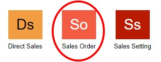


2. Maka akan ditampilkan daftar transaksi penjualan yang sudah dilakukan sebelumnya. Untuk membuat transaksi penjualan baru, klik tombol **New**.

    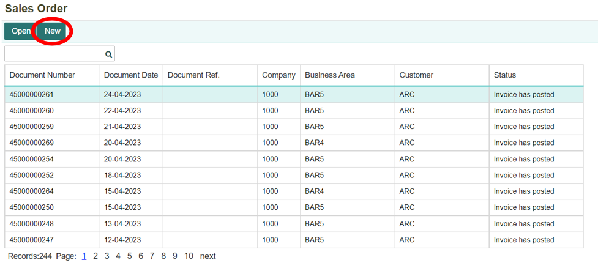

3. Lengkapi dan isi setiap kolom-kolom yang ada untuk form **Sales Order**. Setelah semua kolom telah terisi, kemudian klik tombol **Save** untuk menyimpan dokumen transaksi **Sales Order**.

    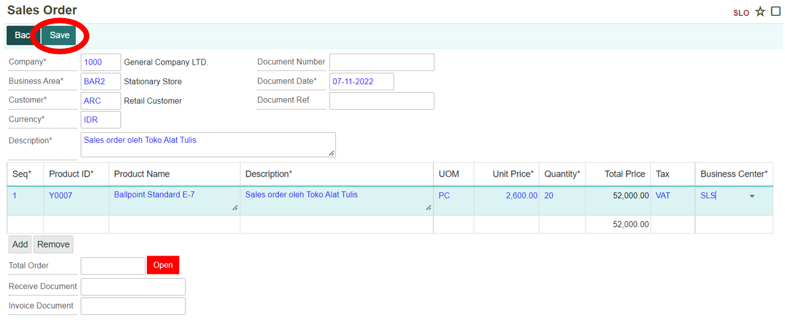
    
Tombol **Add** untuk menambahkan record (menambahkan barang yang dibeli). Sedangkan tombol **Remove** untuk menghapus record (barang yang sudah dimasukkan).

```{note}  Semua kolom yang bertanda (*) wajib diisi

```

**Informasi Kolom:** 

| No. | Kolom            | Keterangan                                          |
|-----|------------------|-----------------------------------------------------|
| 1   | Company          | Kode Perusahaan                                     |
| 2   | Business Area    | Kode Bisnis Area yang Dilakukan Transaksi           |
| 3   | Customer         | Kode Konsumen                                      |
| 4   | Currency         | Mata Uang yang Digunakan                            |
| 5   | Description      | Keterangan                                          |
| 6   | Document Number  | Nomor Dokumen Sales Order                           |
| 7   | Document Date    | Tanggal Pembuatan Dokumen Sales Order               |
| 8   | Document Ref     | Nomor Dokumen Referensi                             |
| 9   | Seq              | Nomor Urut Record                                   |
| 10  | Product ID       | Kode Produk                                        |
| 11  | Product Name     | Nama Produk                                        |
| 12  | UOM              | Satuan Barang                                      |
| 13  | Unit Price       | Harga Barang Satuan                                |
| 14  | Quantity         | Jumlah Banyaknya Barang                            |
| 15  | Tax              | Jenis Pajak yang Digunakan                         |
| 16  | Business Center  | Kode Tempat Bisnis Berlangsung                      |
| 17  | Value Added Tax  | Pajak Pertambahan Nilai (PPN)                      |
| 18  | Witholding Tax   | Pajak yang Dikenakan untuk Barang + Jasa           |
| 19  | Total Order       | Total Harga Belanjaan (Keseluruhan Harga Barang + PPN) |


## Membuat Dokumen Product Transfer

1. Setelah membuat dokumen Sales Order, maka barang akan dikirimkan ke customer. Dalam hal ini, perlu membuat dokumen Product Transfer untuk bukti bahwa barang sudah dikirimkan kepada customer. Untuk membuat dokumen Produk Transfer, dapat dilakukan di dalam menu Product Transfer yang terdapat pada module Product Management. Klik menu Product Transfer (PRTS).

     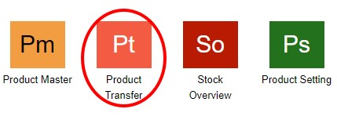

2. Maka akan ditampilkan daftar dokumen yang terdapat di menu Product Transfer. Untuk membuat dokumen Product Transfer yang baru, dengan klik tombol New.

    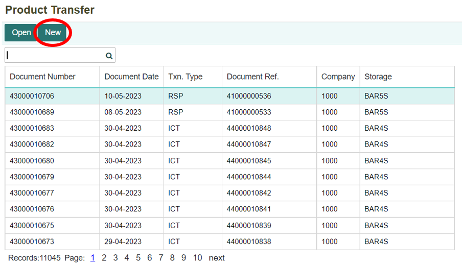

3. Setelah itu pilih tipe transaksi yang akan dilakukan. Pilih “Issue to Customer” karena akan mengirimkan barang kepada customer dan klik tombol Next.

    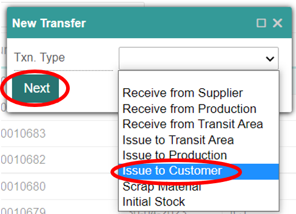

4. Kemudian akan ditampilkan form, isi setiap kolom yang ada. Kemudian masukan nomor dokumen SO dan tanggal disesuaikan dengan tanggal pada saat melakukan pengiriman barang. Setelah itu, klik tombol Save.

    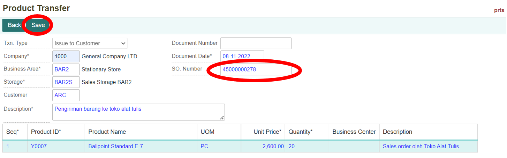

```{note}  Semua kolom yang bertanda (*) wajib diisi

```

**Informasi Kolom:** 

| No. | Kolom          | Keterangan                                  |
|-----|----------------|---------------------------------------------|
| 1   | Txn. Type      | Tipe Transaksi yang Dilakukan               |
| 2   | Company        | Kode Perusahaan                             |
| 3   | Business Area  | Kode Area Bisnis                            |
| 4   | Storage        | Tempat Penyimpanan yang Digunakan           |
| 5   | Customer       | Kode Pelanggan yang Melakukan Transaksi     |
| 6   | Description    | Keterangan                                  |
| 7   | Document Number| Nomor Dokumen Product Transfer              |
| 8   | Document Date  | Tanggal Pembuatan Dokumen                   |
| 9   | SO. Number     | Nomor Dokumen Sales Order                   |
| 10  | Seq            | Nomor Urut Record                           |
| 11  | Product ID     | Kode Produk atau Barang                     |
| 12  | Product Name   | Nama Produk                                |
| 13  | UOM            | Satuan Barang                               |
| 14  | Unit Price     | Harga Barang Satuan                         |
| 15  | Quantity       | Jumlah Banyaknya Barang                     |
| 16  | Business Center| Kode Tempat Bisnis Berlangsung              |

 

5. Setelah data sudah berhasil disimpan. Maka akan terbentuk jurnal dari proses **Product Transfer**. Jurnal tersebut dapat dilihat melalui menu Journal yang terdapat pada module **Accounting**. Berikut jurnal yang terbentuk setelah Product Transfer.

    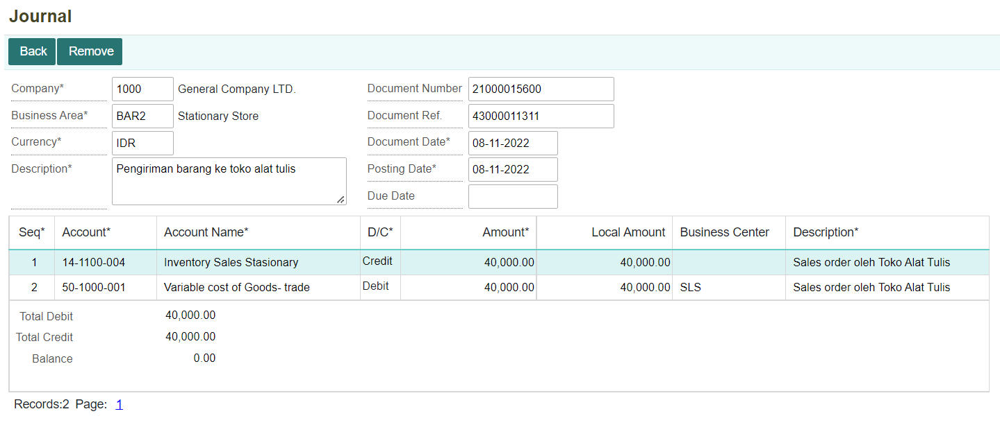

6. Setelah itu, kembali lagi ke menu Sales Order untuk melakukan Post Invoice. Buka kembali dokumen Sales Order yang sudah dibuat, kemudian klik tombol **Post Invoice**.

    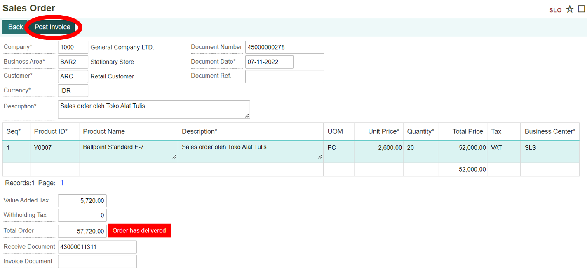

7. Kemudian akan muncul notifikasi konfirmasi untuk membentuk AR (piutang). Klik **OK** apabila setuju dan ingin melanjutkan.

    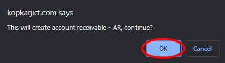

8. Apabila ingin membatalkan, maka klik tombol **Cancel**.

    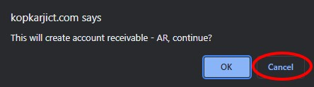

9. Setelah melakukan Post Invoice, jurnal akan otomatis terbentuk seperti berikut

    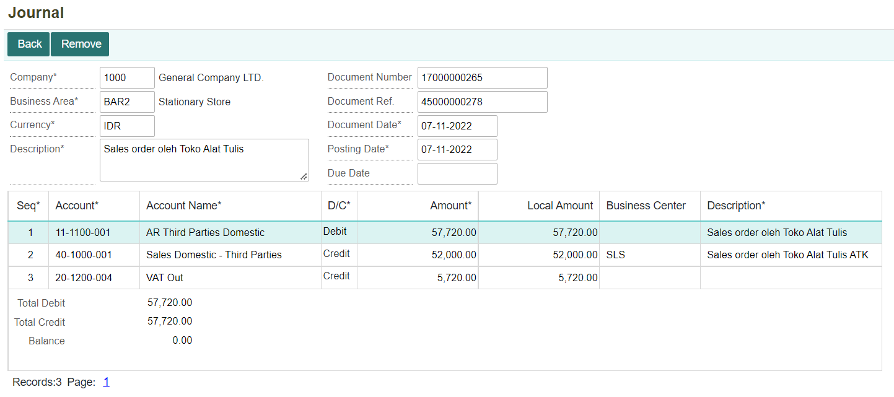

## Melakukan Pembayaran untuk Transaksi Sales Order

1. Sesudah melakukan Post Invoice, maka dokumen AR akan otomatis terbentuk di menu Receivable. Untuk melakukan pembayaran, dapat dilakukan di dalam menu Receivable yang terdapat pada module Accounting. Klik menu **Receivable (RCV)**.

    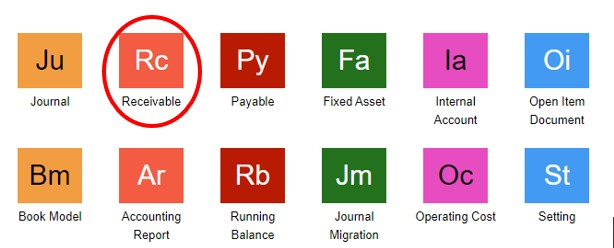

2. Maka akan ditampilkan daftar transaksi penjualan yang sudah dilakukan sebelumnya.  

    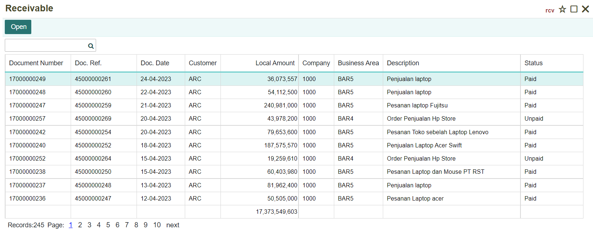

3. Untuk mempermudah pencarian dokumen Receivable untuk transaksi Sales Order yang dilakukan, dapat dengan cara melakukan pencarian nomor dokumen Sales Order di kolom pencarian. Kemudian klik tombol **Open** untuk membuka dokumen.

     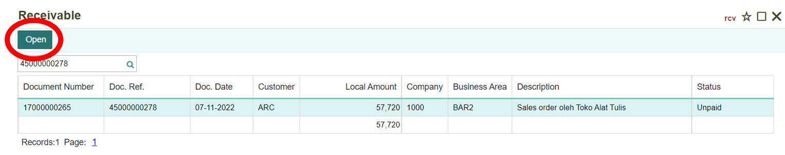

4. Kemudian akan ditampilkan dokumen Receivable. Setelah itu, klik tombol **Payment** untuk melakukan pembayaran. Status masih **“Unpaid”**.

    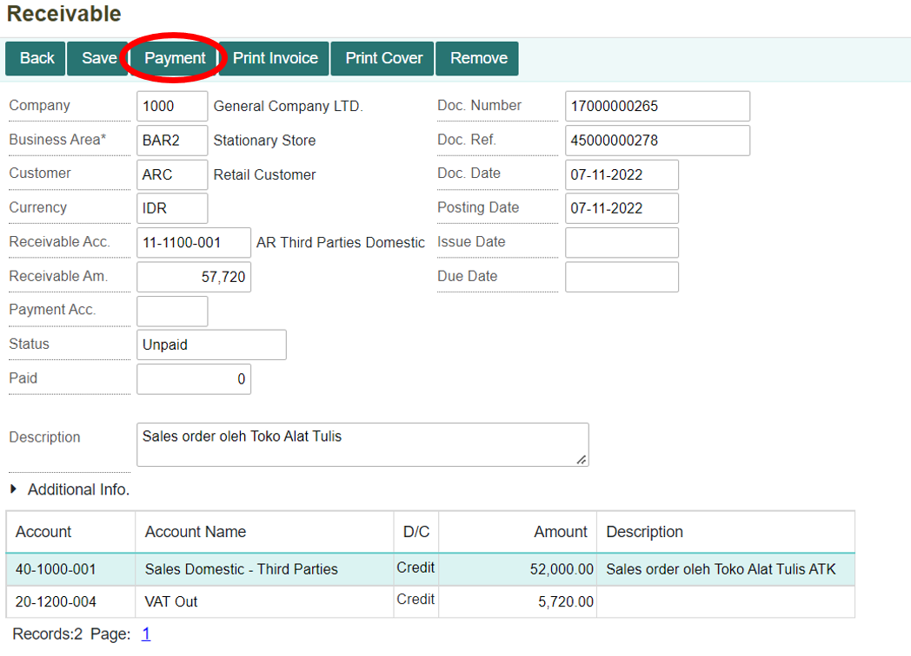

5. Selanjutnya pilih akun pembayaran yang akan digunakan di kolom Payment Acc. Dan juga atur tanggal sesuai tanggal pembayaran. Kemudian klik tombol **Save**.

    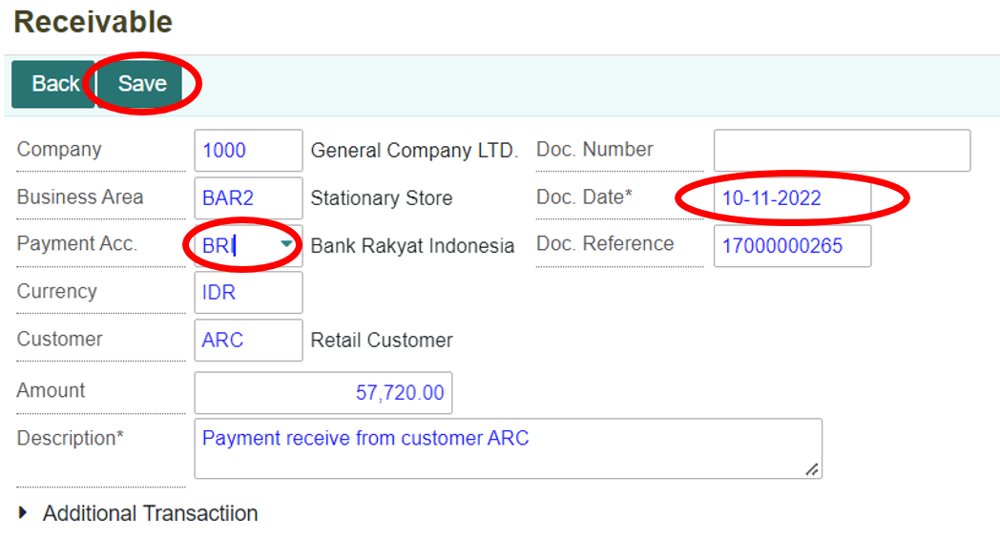

6. Maka pembayaran berhasil dilakukan, status akan berubah menjadi **“Paid”**.

    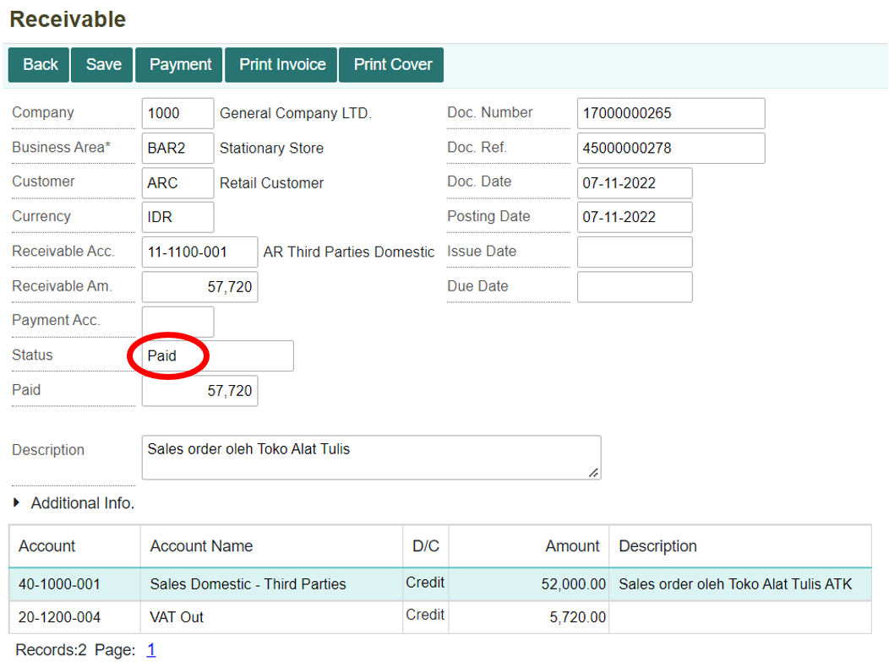

7. Transaksi pembayaran SO akan membentuk dokumen di internal account secara otomatis.

    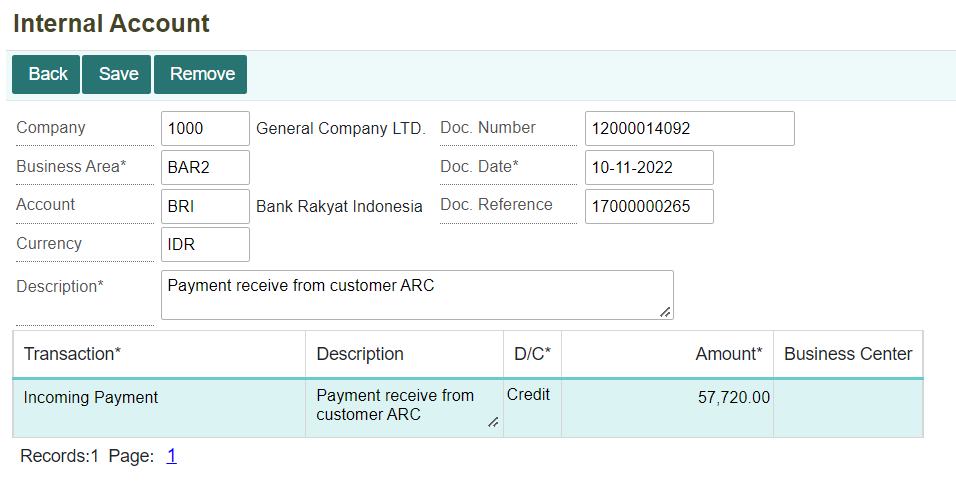

8. Selain itu, terbentuk juga jurnal secara otomatis.

    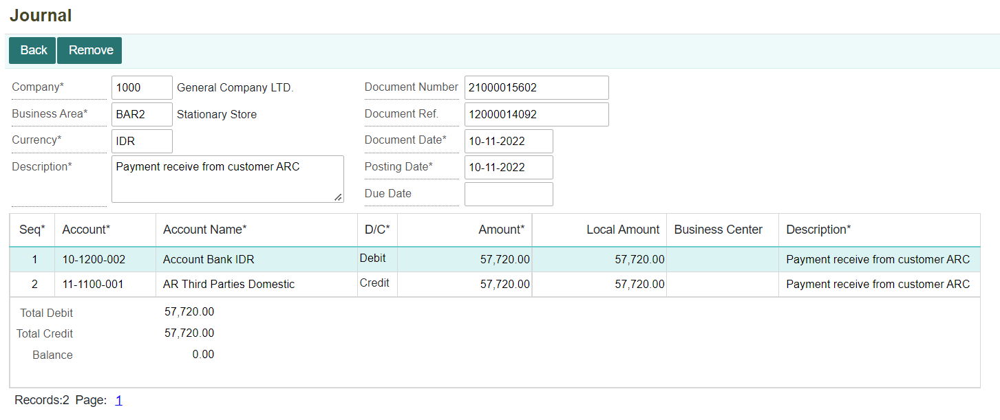

```{tableofcontents}
```
