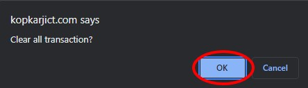
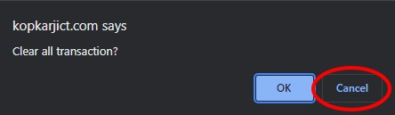

# Menghapus Inisialisasi Data

## Clear Initial Data

Clear initial data digunakan untuk menghapus data transaksi yang sudah tersimpan sebelumnya pada **AKOR**. Hal ini dilakukan agar data yang baru, tidak tercampur pada data transaksi yang telah ada sebelumnya. Setelah terhapus, data transaksi di dalam sistem **AKOR** akan hilang.

1. Untuk melakukan clear initial data, langkah pertama klik module **System**.

    

2. Kemudian akan ditampilkan menu-menu yang terdapat pada module System, selanjutnya klik menu **Clear Transaction**.

    

3. Selain itu, dapat membuka menu clear transaction dengan melakukan pencarian pada kolom pencarian di aplikasi **AKOR**. Lalu ketikkan kode menu **CLRTX**.

    

4. Selanjutnya untuk menghapus semua data yang terdapat di **AKOR**, klik tombol Clear.

    

5. Kemudian akan tampil notifikasi konfirmasi. Klik tombol **OK**, apabila ingin menghapus semua data.

    

6. Dan apabila tidak ingin menghapus semua data, dapat dengan klik tombol **Cancel**, maka penghapusan data akan dibatalkan.

    

