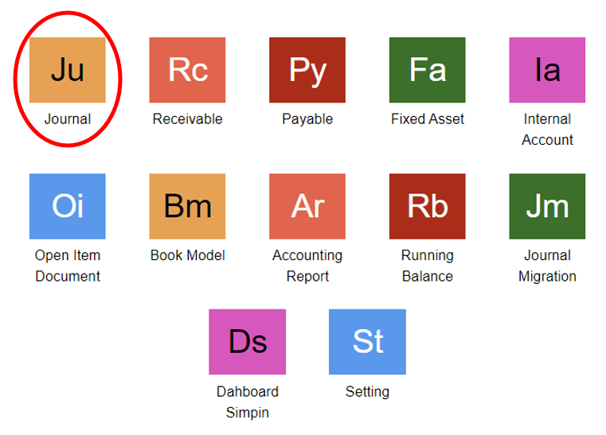
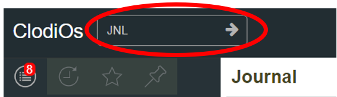
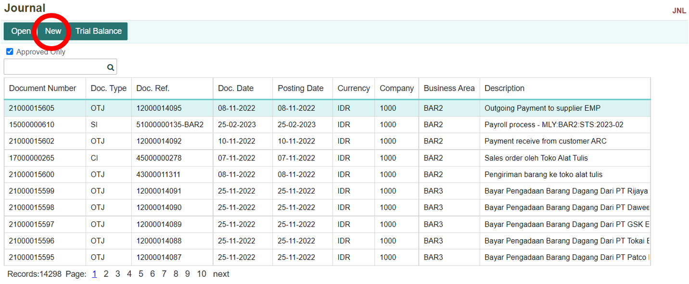
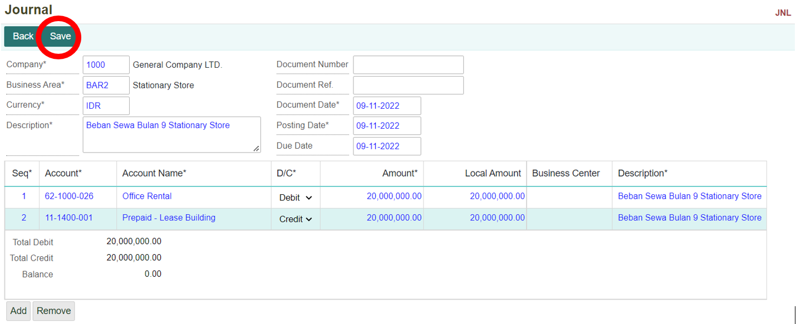
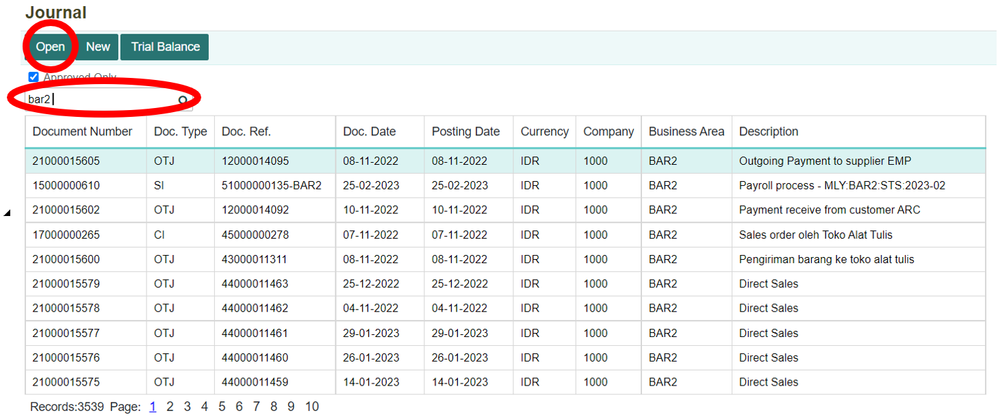

# Journal

## Menu Journal
Menu journa; (JNL) adalah suatu menu yang digunakan untuk mencatat memorial journal, menampilkan neraca atau balance sheet, menampilkan detail transaksi pada masing-masing account, dan juga bisa digunakan untuk menampilkan transaksi journal yang dilakukan melalui modul-modul lain.

Daftar Isi :
1. Cara menjalankan menu journal (JNL)
2. Membuat memorial journal
3. Menampilkan detail pada transaksi journal

## Cara Menjalankan Menu Journal (JNL)
1. Buka module **Accounting** pada halaman utama sistem.
 

2. Kemudian pilih menu **Journal**.
 

3. Selain itu, pengguna juga dapat membuka menu Journal dengan mengetikkan kode program **JNL** pada kolom pencarian, kemudian tekan ikon **Panah** atau tombol **Enter** pada keyboard.
 

## Membuat Memorial Journal
1. Pada halaman utama Journal, tekan tombol **New** untuk membuat Memorial Journal.
 

2.  Maka akan tampil form untuk membuat jurnal baru. Isi dan lengkapi kolom-kolom yang ada. Kemudian klik tombol **Save**. Akan muncul notifikasi bahwa data berhasil tersimpan.
 

    ```{note} * Isi semua kolom yang terdapat tanda (*)
    * Kolom Account harus unik.
    ```

**Informasi Kolom**
| No. | Kolom          | Keterangan                     |
| --- | -------------- | ------------------------------ |
| 1   | Company        | Kode Perusahaan                |
| 2   | Business Area      | Kode Area Bisnis/Cabang                   |
| 3   | Currency           | Mata Uang                   |
| 4   | Description    | Keterangan Transaksi                   |
| 5   | Document Number     | ID Dokumen                   |
| 6   | Document Ref             | Referenssi Dokumen                   |
| 7   | Document Date         | Tanggal Transaksi          |
| 8   | Posting Date | Tanggal Posting Journal        |
| 9   | Due Date       | Tanggal Jatuh Tempo                   |
| 10  | Seq      | Nomor Urut Transaksi      |
| 11  | Account    | Kode Account Transaksi                     |
| 12  | Account Name        | Nama Account                 |
| 13  | D/C          | Debit/Credit           |
| 14  | Amount          | Nilai Transaksi  
| 15  | Local Amount       | Konversi Nilai Lokal                 |
| 13  | Business Center          | Kode Business Center           |
| 14  | Description          | Keterangan Detail Transaksi  

## Menampilkan Detail Transaksi Journal
1. Untuk mencari data dengan kriteria tertentu, masukkan kriteria yang diinginkan pada kolom pencarian, setelah itu klik tombol **Open** untuk melihat detail transaksi yang dipilih.
 

2. Maka akan ditampilkan detail transaksi sebagai berikut.
 