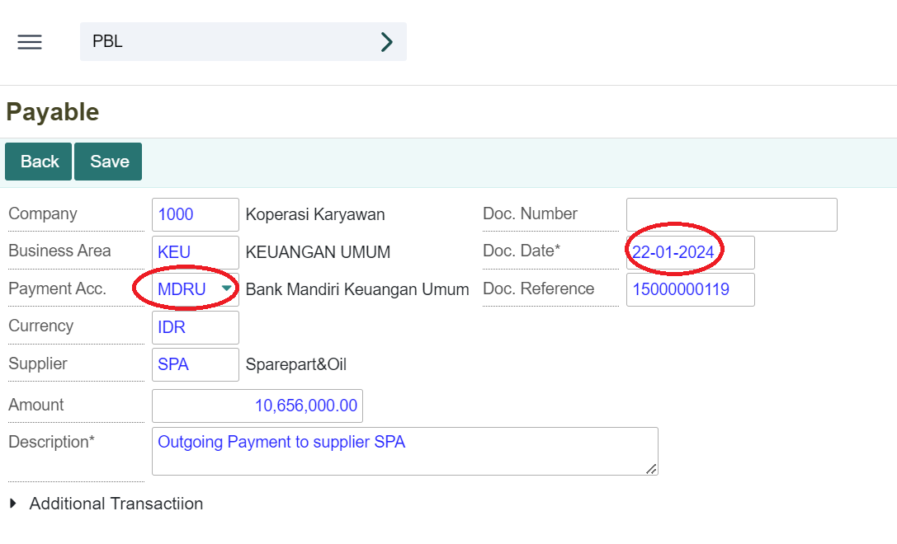
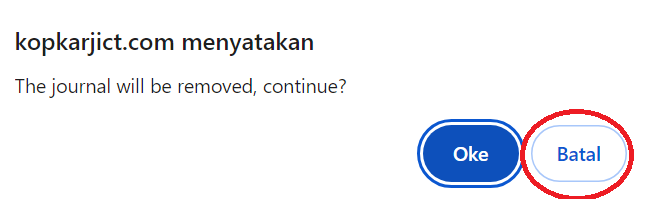

# Payable

## Menu Payable
Menu payable digunakan untuk mencatat pembayaran hutang yang dimiliki oleh perusahaan. Dokumen payable secara otomatis akan terbentuk ketika melakukan Post Payable pada proses transaksi penjualan melalui Purchase Order.

Daftar Isi:
1. Cara menjalankan menu payable
2. Membuka dokumen payable
3. Melakukan pembayaran payable
4. Menghapus dokumen payable

## Cara Menjalankan Menu Payable
1. Untuk menjalankan menu payable, klik module **Accounting** pada halaman utama.

 

2. Kemudian akan ditampilkan menu-menu yang terdapat pada module Accounting, klik menu **Payable**.

 
 
3. Selain itu, dapat juga membuka menu Payable dengan mengetikkan kode program **PBL** pada kolom pencarian, kemudian klik ikon **Panah** atau tombol **Enter** pada keyboard.

 

## Membuka Transaksi Payable
1. Untuk mempermudah pencarian transaksi payable dengan menggunakan nomor referensi dokumen yang akan dibayar kemudian cari pada kolom pencarian.

 

2. Setelah itu klik tombol **Open** untuk membuka transaksi payable.

 

## Melakukan Pembayaran Payable
1. Dokumen yang telah dibuka berstatus “Unpaid” maka untuk melakukan pembayaran klik tombol **Payment**.

 

2. Selanjutnya akan ditampilkan form untuk melakukan pembayaran pilih akun pembayaran yang akan digunakan di kolom **Payment Acc**. Dan juga atur tanggal sesuai tanggal pembayaran.

 

3. Kemudian klik tombol **Save** untuk menyimpan transaksi pembayaran.

 

4.  Maka status akan berubah menjadi “Paid”

 

## Menghapus Dokumen Payable
1. Buka salah satu dokumen yang ingin dihapus. Setelah dokumen berhasil terbuka, maka klik tombol **Remove**.

 
2. Kemudian akan tampil notifikasi konfirmasi penghapusan dokumen. Klik tombol **OK** untuk menyetujui penghapusan dokumen.

 

3.  Apabila ingin membatalkan penghapusan dokumen klik tombol **Cancel**.

 
 