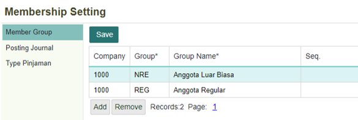
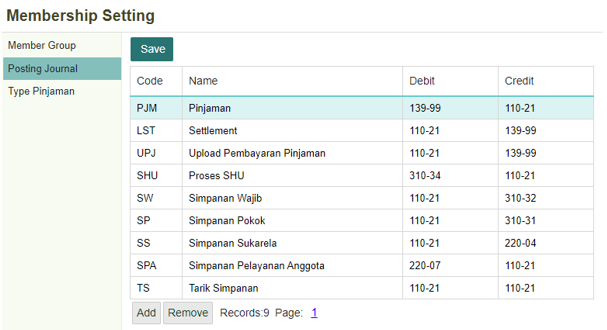
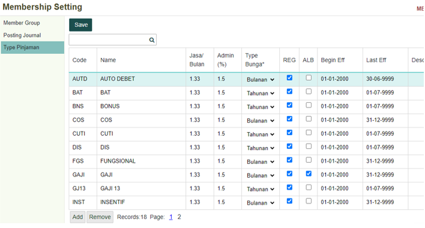

# Pengaturan Member

## **Membership Setting**
 
Membership Setting adalah menu di mana Anda dapat mengatur beberapa pengaturan terkait tipe keanggotaan di sistem.
Membership Group

   
 
Dalam halaman ini kita dapat mengatur membership, seperti  kategori member regular dan member non-regular.

| No. | Kolom   | Keterangan                           |
|-----|---------|--------------------------------------|
| 1   | Company | Kode perusahaan                      |
| 2   | Group   | Kategori group perusahaan            |
| 3   | Company | Penjelasan singkatan kolom Group    |
| 4   | Seq     | Sequence                             |

	

## **Posting Journal**

   
 

| No. | Kolom  | Keterangan              |
|-----|--------|-------------------------|
| 1   | Code   | Kode Journal            |
| 2   | Name   | Penjelasan kode journal |
| 3   | Debit  | Kode pengeluaran        |
| 4   | Kredit | Kode pemasukan          |

Halaman di atas merupakan kode dari transaksi apa yang tengah dilakukan antara anggota dan Anda.

## **Type Pinjaman**

   
 
Halaman ini memperlihatkan cara pembayaran untuk sebuah peminjaman. Berikut adalah 

| No. | Kolom      | Keterangan                  |
|-----|------------|-----------------------------|
| 1   | Code       | Kode Journal                |
| 2   | Name       | Penjelasan kode journal     |
| 3   | Jasa/Bulan  | Kode pengeluaran            |
| 4   | Admin(%)    | Kode pemasukan              |
| 5   | REG        | Anggota Reguler             |
| 6   | ALB        | Anggota Luar Biasa          |
| 7   | Begin Eff   | Mulai tanggal Effective     |
| 8   | Last Eff    | Sampai tanggal Effective    |
| 9   | Desc       | Deskripsi Jurnal            |

