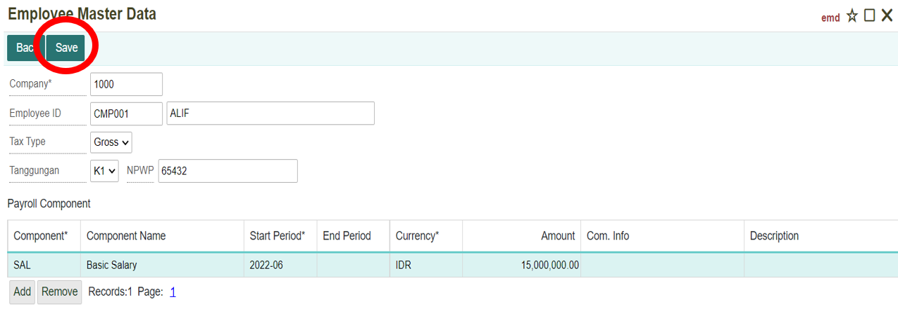

# Employee Data

## Menu Employee Data
Menu employee master data adalah salah satu menu di dalam Personnel Management yang berisikan informasi data-data setiap karyawan yang ada di perusahaan, baik data pribadi, data keorganisasian maupun data payroll dari karyawan tersebut.

Daftar isi:
1. Cara menjalankan menu employee data
2. Membuat master data karyawan
3. Menampilkan data karyawan
4. Mengubah master data karyawan
5. Menghapus data karyawan

## Cara Menjalankan Menu Employee Data
1. Untuk menjalankan menu Employee Data. Hal pertama adalah klik module **Personnel Management** pada halaman utama.

    
	

2. Setelah masuk kedalam module Personnel Management, selanjutnya klik menu **Employee Data.**

    


3. Atau bisa ketik **EMD** pada kolom pencarian untuk langsung membuka menu Employee Master Data.

    


## Membuat Master Data Karyawan
1. Untuk membuat master data karyawan yang baru, klik icon di Employee Master Data.


2. Maka akan ditampilkan form untuk menambahkan data karyawan baru. Isi dan lengkapi setiap kolom yang ada. Untuk form employee master data memiliki 7 komponen penting yang perlu diisi.

- Personal Data


```{Note} * - Semua kolom yang bertanda (*) wajib diisi
		  - Untuk kolom age akan terisi secara otomatis
```

**Informasi Kolom**
| No   | Kolom                  | Keterangan                    |
| ---  | --------------         | ------------------------      |
|  1   | Company                | Kode Perusahaan               |
|  2   | Employee ID            | Kode Karyawan                 |
|  3   | Name                   | Nama Karyawan                 |
|  4   | Birth Place            | Tempat Lahir                  |
|  5   | Birth Date             | Tanggal Lahir                 |
|  6   | Age                    | Usia Karyawan                 |
|  7   | Gender                 | Jenis Kelamin Karyawan        |
|  8   | Martial Status         | Status Pernikahaan kawryawan  |
|  9   | Religion               | Agama Karyawan                |
|  10  | Education              | Pendidikan Terakhir Karyawan  |
|  11  | Description            | Keterangan                    |

    - Address


``` {Note} * Semua kolom yang bertanda (*) wajib diisi
```

**Informasi Kolom**
| No   | Kolom       | Keterangan                    |
| ---  | --------    | -----------------             |
|  1   | Address     | Alamat Karyawan               |
|  2   | Phone       | Nomor Telpon Karyawan         |
|  3   | Email       | Alamat Email Karyawan         |
|  4   | Emergency Adress       | Alamat/Kontak Darurat Karyawan                                             |

- Organization


```{Note} * Semua kolom yang bertanda (*) wajib diisi
```

**Informasi Kolom**
| No   | Kolom     | Keterangan                         |
| ---  | -------   | ------------------                 |
|  1   | Begin     | Tanggal Mulai Berkerja Karyawan    |
|  2   | Last      | Tanggal Terakhir Berkerja Karyawan |
|  3   | Area      | Kode Tempat Berkerja Karyawan      |
|  4   | Group     | Kelompok Karyawan                  |
|  5   | Unit      | Unit Perkerjaan Karyawan           |
|  6   | Status    | Status Karyawan                    |
|  7   | Term Eff. | -                                  |
|  8   | Job       | Perkerjaan Karyawan                |
|  9   | Position  | Jabatan Karyawan                   |
|  10  | Grade     | Golongan Karyawan                  |

- Payroll Data


``` {Note} * Semua kolom yang bertanda (*) wajib diisi
```

**Informasi Kolom**
| No   | Kolom              | Keterangan                            |
| ---  | -----------        | ----------------------                |
|  1   | Payroll Area       | Kode Area Penggajian                  |
|  2   | Business Area      | Kode Area Bisnis                      |
|  3   | Busniness Center   | Kode Tempat Bisnis Berlangsung        |
|  4   | Bank               | Nama Bank Karyawan                    |
|  5   | Payee              | Nama Pemilik Rekening Karyawan        |
|  6   | Bank Account       | Nomor Rekening Karyawan               |

- Membership


Tombol **Add** untuk menambahkan record (kolom) baru. Sedangkan tombol **Remove** untuk menghapus record (kolom).

``` {Note} * Semua kolom yang bertanda (*) wajib diisi
```

**Informasi Kolom**
| No   | Kolom              | Keterangan                            |
| ---  | -----------        | ----------------------                |
|  1   | Code               | Kode Membership                       |
|  2   | Membership Name    | Nama Membership                       |
|  3   | Begin Eff.         | Tanggal Mulai                         |
|  4   | Last Eff.          | Tanggal Berakhir                      |
|  5   | Description        | Keterangan                            |
|  6   | Member ID          | Nomor Member Karyawan                 |

- Family


Tombol **Add** untuk menambahkan record (kolom) baru. Sedangkan tombol **Remove** untuk menghapus record (kolom).

**Informasi Kolom**
| No   | Kolom              | Keterangan                            |
| ---  | -----------        | ----------------------                |
|  1   | Seq                | NOmor Urut                            |
|  2   | Name               | Nama                                  |
|  3   | Gender             | Gender                                |
|  4   | Rel Type           | Hubungan dengan Karyawan              |
|  5   | Birth Date         | Tanggal Lahir                         |
|  6   | Matrial Status     | Status Pernikahan                     |

- Educational Background


Tombol **Add** untuk menambahkan record (kolom) baru. Sedangkan tombol Remove untuk menghapus record (kolom).

**Informasi Kolom**
| No   | Kolom              | Keterangan                   |
| ---  | -----------------  | -----------------            |
|  1   | Seq                | Nomor Unit                   |
|  2   | Education Name     | Nama Pendidikan              |
|  3   | Degree             | Gelar Karyawan               |
|  4   | Major              | Fakultas                     |
|  5   | Minor              | Program Studi                |
|  6   | G.P.A              | IPK/Nilai Karyawan           |
|  7   | Graduation Grade   | Tanggal Kelulusan            |
|  8   | Predicate          | Pendidikan Karyawan          |
|  9   | Description        | Keterangan                   |

3. Setelah semua sudah dilengkapi, selanjutnya klik tombol **Save.** Maka akan tampil notifikasi bahwa data berhasil tersimpan.


4. Kemudian di bagian Payroll Data, akan muncul tombol baru, yaitu Payroll Detail. Klik tombol **Payroll Detail.**


5. Maka akan ditampilkan form baru untuk membuat Payroll Component. Isi setiap kolom yang ada. Setelah itu, klik tombol **Save.**




Tombol **Add** untuk menambahkan record (kolom) baru. Sedangkan tombol **Remove** untuk menghapus record (kolom).

```{Note} * Semua kolom yang bertanda (*) wajib diisi
```

**Informasi Kolom**
| No   | Kolom						| Keterangan							|
| ---  | ---------------------		| ----------------------------			|
|  1   | Company					| Kode Perusahaan						|
|  2   | Employee ID				| Kode Karyawaan						|
|  3   | Tax Type					| Tipe Pajak Karyawaan					|
|  4   | Tanggungan					| Tanggungan Karyawaan					|
|  5   | NPWP						| Nomor NPWP Karyawaan					|
|  6   | Component					| Kode Komponen Gaji					|
|  7   | Component Name				| Nama Komponen Gaji					|
|  8   | Start Period				| Tanggal Muda Periode Komponen			|
|  9   | End Period					| Tanggal Akhir Periode Komponen		|
|  10  | Currency					| Mata Uang Yang di Gunakan				|
|  11  | Amount						| Jumlah/Nilai Komponen					|
|  12  | Com.info					| Info Komponen							|
|  13  | Description				| Keterangan

## Menampilkan Data Karyawan
1. Apabila ingin melihat data salah satu karyawan, dapat dengan cara melakukan pencarian di kolom pencarian Employee Master Data.


2. Setelah itu sistem akan otomatis menampilkan data yang dicari. Kemudian untuk melihat data karyawan, dapat dengan klik **Gambar/Nama karyawan.** Maka sistem akan otomatis menampilkan detail data karyawan tersebut. Klik tombol **Back** untuk kembali ke halaman sebelumnya.


# Mengubah Data Karyawaan
1. Sebelumnya dibuka terlebih dahulu data karyawan yang ingin diubah. Kemudian klik dan lakukan perubahan pada kolom yang ingin diubah.


2. Kemudian klik tombol **Save.** Maka akan tampil notifikasi, data berhasil disimpan.


# Menghapus Data Karyawan
1. Sebelumnya dibuka terlebih dahulu data karyawan yang ingin dihapus.


2. Selanjutnya klik **Remove,** untuk menghapus data karyawan tersebut.


3. Setelah itu, akan muncul notifikasi konfirmasi (alert) untuk penghapusan data. Apabila ingin tetap menghapus data karyawan tersebut, maka klik tombol **OK.**


4. Apabila ingin membatalkan penghapusan data karyawan, klik tombol **Cancel.**

