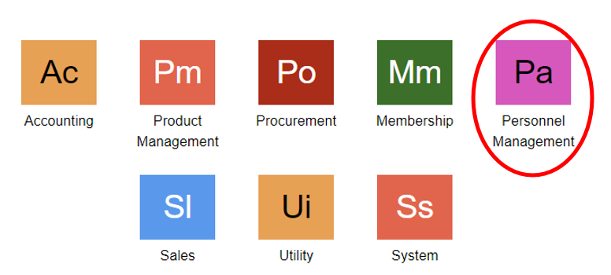
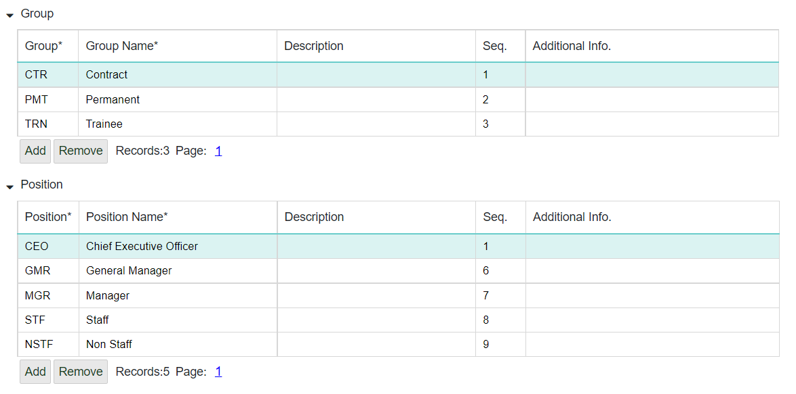

# HR Setting

## Menu HR Setting
Menu HR setting adalah pengaturan pada bagian HR untuk mempermudah sistem mengidentifikasi data karyawan.

Daftar Isi:

1. Cara menjalankan menu HR setting
2. Pengaturan organization
3. Pengaturan membership
4. Pengaturan payroll
5. Pengaturan time attendance

## Cara Menjalankan Menu HR Setting
1. Untuk menjalankan menu HR Setting. Hal pertama adalah klik module **Personnel Management** pada halaman utama.
    

2. Selanjutnya maka akan ditampilkan menu-menu yang terdapat pada module Personnel Management. Kemudian klik menu **HR Setting.**
    

3. Selain itu, dapat membuka menu HR Setting dengan melakukan pencarian pada kolom pencarian Lalu ketikkan kode menu **HRST.**
    

## Pengaturan Sub Menu Organization
1. Untuk melakukan pengaturan terhadapa sub menu Organization, langkah pertama buka terlebih dahulu pengaturan organization yang diinginkan. Dengan klik salah satu Organization yang diinginkan, lalu klik **Open.**
    

2. Kemudian akan ditampilkan pengaturan untuk sub menu Organization. Apabila ingin menambahkan Organization Unit yang baru, dapat dengan klik ikon +.
    

3. Maka akan ditampilkan form untuk menambahkan unit baru. Isi setiap kolom yang ada. Kemudian klik tombol **OK.**
    
```{Note} * Isi semua kolom yang bertanda (*)
```

**Informasi Kolom**
| No   | Kolom | Keterangan            |
| ---  | ----- | -----------           |
|  1   | Unit  | Kode Unit             |
|  2   | Nama  | Nama Unit Organisasi  |

4. Kemudian untuk menghapus salah satu unit organisasi yang dibuat, dengan klik unit organisasi yang ingin di hapus, lalu klik ikon **Remove.**
    

5. Maka akan tampil notifikasi konfirmasi untuk penghapusan. Klik tombol **OK** untuk menghapus, apabila ingin membatalkan penghapusan klik tombol **Cancel.**
    

6. Untuk melakukan refresh data, maka klik tombol **Refresh.**
    

7. Selain untuk menambahkan unit organization yang baru, dapat juga menambahkan setiap komponen yang ada di dalam organization, seperti **Group, Position, Job, Area, Grade, Unit Type.**
    

    

    
```{Note} * Isi semua kolom yang bertanda (*)
```

**Informasi Kolom**
| No   | Kolom           | Keterangan                   |
| ---  | ------------    | ------------------------     |
|  1   | Description     | Keterangan                   |
|  2   | Seq             | Urutan                       |
|  3   | Additional Info | Informasi Tambahan           |
|  4   |Group            | Kode Kelompok                |
|  5   |Group Name       | Nama Kelompok (Group)        |
|  6   |Position         | Kode Posisi                  |
|  7   | Position Nama   | Nama Posisi                  |
|  8   | Job             | Kode Pekerjaan               |
|  9   | Job Name        | Nama Pekerjaan               |
|  10  | Area            | Kode Area                    |
|  11  | Area Name       | Nama Area                    |
|  12  | Grade           | Kode Nilai atau Tingkatan    |
|  13  | Grade Name      | Nama Nilai atau Tingkatan    |
|  14  | Unit Type       | Kode Tipe Unit               |
|  15  | Name           | Nama Unit                    |

8. Untuk menambahkan kolom baru pada setiap masing-masing komponen. Klik **Add.**
    

9. Kemudian isi dan lengkapi informasi kolom yang ada. Setelah itu untuk menyimpan data yang sudah ditambahkan, **Save** yang di atas.
    

10. Kemudian untuk menghapus kolom yang sudah ada atau menghapus data organization yang sudah ada klik **Remove.**
  

11. Setelah itu, klik **Save** untuk menyimpan data.

## Pengaturan Membership
1. Kemudian untuk menambahkan membership, dapat dengan klik sub menu **Membership.**
    

2. Kemudian untuk menambahkan membership yang baru, klik tombol **Add**
    

3. Maka sistem akan menambahkan kolom baru yang kosong secara otomatis. Isi dan lengkapi kolom tersebut, setelah itu klik tombol **Save.**
    

4. Kemudian untuk menghapus kolom yang sudah ada atau menghapus data organization yang sudah ada klik tombol **Remove.**
    

5. Setelah itu, klik tombol **Save** untuk menyimpan data.

## Pengaturan Payroll
1. Untuk melakukan pengaturan pada untuk payroll. Dapat dengan klik sub menu Payroll.
    

2. Pada sub menu Payroll, terdapat beberapa komponen : Payroll Area, Payroll Component, dan Payroll Type.

- Payroll Area
  Untuk mengatur atau menambahkan payroll area yang baru, dapat dengan klik tombol **Add.**
  

**Informasi Kolom**
| No   | Kolom          | Keterangan                |
| ---  | --------       | -------------------       |
|  1   | Payroll Area	| Kode Area Penggajian      |
|  2   | Name           | Nama Area Penggajian      |
|  3   | Description	| Keterangan                |

  Setelah kolom telah terisi, klik tombol **Save** untuk menyimpan data.
  

Apabila ingin menghapus data yang sudah ada atau kolom yang ada, dapat dengan klik kolom yang ingin di hapus, kemudian klik tombol **Remove,** setelah itu klik tombol **Save** untuk menyimpan perubahan
  

- Payroll Component
  Untuk mengatur atau menambahkan payroll component yang akan digunakan, dapat dengan klik tombol **Add**
  

**Informasi Kolom**
| No   | Kolom          | Keterangan                |
| ---  | --------       | -------------------       |
|  1   | Code	        | Kode Komponen Penggajian  |
|  2   | Name           | Nama Komponen Penggajian  |
|  3   | Seq	        | Urutan                    |
|  4   | Custom	        | -                         |
|  5   | State          | -                         |
|  6   | Tax Group	    | Kelompok Pajak            |
|  7   | Description    | Keterangan                |

Setelah kolom telah terisi, klik tombol **Save** untuk menyimpan data.
  

Apabila ingin menghapus data yang sudah ada atau kolom yang ada, dapat dengan klik kolom yang ingin di hapus, kemudian klik tombol Remove, setelah itu klik tombol Save untuk menyimpan perubahan.
**Save** untuk menyimpan perubahan.
  

- Payroll Type
  Untuk membuat atau menambahkan tipe penggajian yang baru, dapat dilakukan dengan klik tombol Add.
  

**Informasi Kolom**
| No   | Kolom    | Keterangan                 |
| ---  | ------   | ------------------         |
|  1   | Type     | Kode Tipe Penggajian       |
|  2   | Name     | Nama Tipe Penggajian       |
|  3   | Description    | Keterangan           |

Setelah kolom telah terisi, klik tombol Save untuk menyimpan data.
  

Untuk menambahkan komponen-komponen yang terdapat di dalam salah satu Payroll Type. Klik tombol **Detail.**
  

Apabila ingin menghapus data yang sudah ada atau kolom yang ada, dapat dengan klik kolom yang ingin di hapus, kemudian klik tombol **Remove**, setelah itu klik tombol
   

```{Note} * Isi semua kolom yang bertanda (*)
```

## Pengaturan Time Attendance
1. Untuk melakukan pengaturan pada untuk time attendance. Dapat dengan klik sub menu **Payroll.**
  

2. Pilih salah satu company yang ingin dilakukan pengaturan time attendance. Kemudian klik tombol **Open.**
  

3. Untuk pengaturan Time Attendance ini mempunyai 3 komponen, yaitu Work Location, Work Schedule, Absence Type.
  

4. Kemudian ketika ingin menambahkan kolom atau data yang baru, klik tombol **Add.** Isi dan lengkapi setiap kolom.
  

``` Isi semua kolom yang bertanda (*)
```

**Informasi Kolom**
| No   | Kolom                  | Keterangan                        |
| ---  | ------------------     | ----------------------------      |
|  1   | Code                   | Kode                              |
|  2   | Work Location Name     | Tempat Lokasi Bekerja             |
|  3   | Description            | Keterangan                        |
|  4   | Seq                    | Urutan/Nomor Urut                 |
|  5   | Additional Info.	    | Informasi Tambahan/Pilihan        |
|  6   | Custom                 | -                                 |
|  7   | Schedule Name	        | Nama Jadwal                       |
|  8   | Absence Name	        | Nama Absen                        |

5. Setelah kolom sudah terisi, maka klik tombol **Save** untuk menyimpan data yang baru dimasukkan.
  
6. Kemudian untuk menghapus kolom yang sudah ada atau menghapus data time attendance yang sudah ada klik tombol **Remove.**
  
7. Setelah itu, klik tombol **Save** untuk menyimpan data.
