# Direct Purchase

## Menu Direct Purchase
Menu direct purchase merupakan menu yang digunakan untuk pembelian atau pengadaan barang dan jasa dengan pembayaran secara langsung.

Daftar isi :

1. Cara menjalankan menu direct purchase
2.  Membuat transaksi pembelian barang menggunakan direct purchase.
3. Menghapus transaksi pembelian barang menggunakan direct purchase

## Cara Menjalankan Menu Direct Purchase
1. Untuk menjalankan menu Direct Purchase. Hal pertama adalah klik module **Procurement** pada halaman utama.
     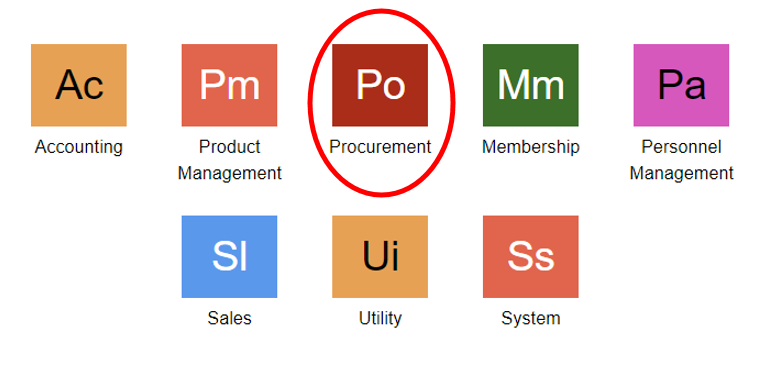

2.  Kemudian akan ditampilkan menu-menu yang terdapat pada module Procurement. Setelah itu, klik **Direct Purchase.**
     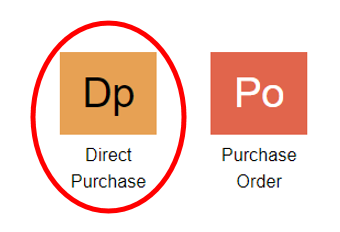

3. Atau bisa ketik **DPU** pada kolom pencarian untuk membuka menu Direct Purchase
    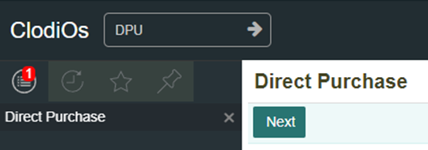

## Membuat Transaksi Pembelian Barang Menggunakan Direct Purchase
1. Setelah masuk ke dalam menu Direct Purchase, isi dan lengkapi kolom dengan cara memilih sesuai informasi yang dibutuhkan pada kolom, setelah semua kolom terisi kemudian klik tombol **Next**
    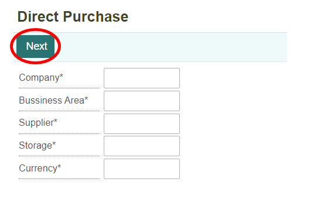

```{NOTE} * isi semua kolom yang bertanda (*) wajib di isi
```

**Informasi kolom**
| No  | Kolom       | Keterangan            |
| --- | --------    | -----------           |
|  1  | Company     | Kode Perusahaan       |
|  2  | Business Area | Kode Perusahaan Area |
|  3  | Supplier    | Kode Supplier         |
|  4  | Storage     | Kode Barang Penyimpanaan  |
|  5  | Currency    | Mata Uang yang Di Gunakaan |

2. Didalam menu Direct Purchase  dapat membuka transaksi direct purchase yang telah dibuat dengan klik tombol **Open**
    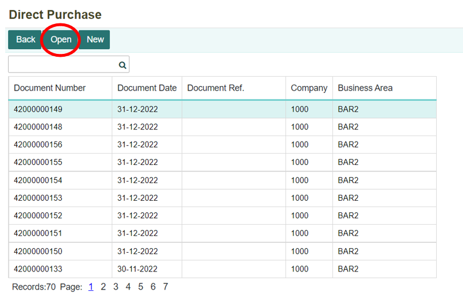

3. Sedangkan untuk membuat transaksi direct purchase yang baru dengan klik tombol **New**
    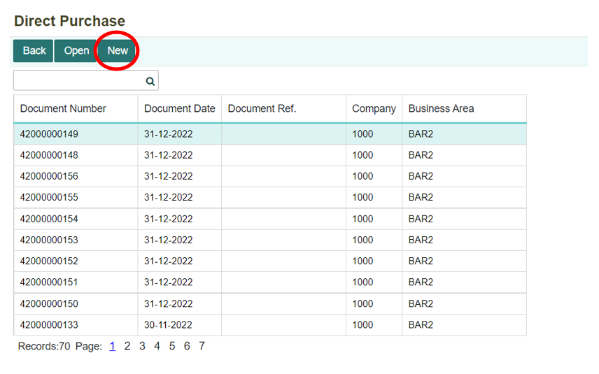

4. Dalam membuat transaksi direct purchase pertama-tama perlu mengatur tanggal sesuai transaksi yang akan dibuat kemudian memasukan barang-barang yang akan dipesan.
    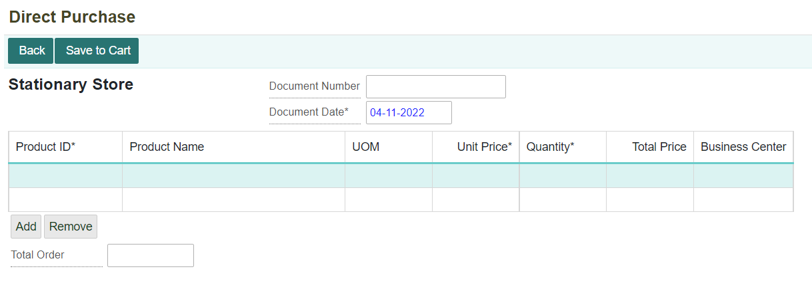

```{Note} * - Semua kolom yang bertanda (*) wajib d isi
- Product Name, UOM, dan Unit Price sudah otomatis terisi saat memasukkan Product ID
```

**Informasi Kolom**
| No  | Kolom               | Keterangan                    |
| --- | --------------------| ------------------------------|
|  1  | Document Number     | Nomor Dokumen Direct Purchase |
|  2  | Document Date	    | Tanggal Pembuatan Dokumen     |
|  3  | Product ID          | Kode Produk                   |
|  4  | Product Name        | Nama Produk                   |
|  5  | UOM                 | Satuan Barang                 |
|  6  | Unti Price          | Harga Barang                  |
|  7  | Quantity            | Banyaknya Barang              |
|  8  | Total Price         | Total Harga Belanjaan (Perbarang)                                                 |
|  9  | Business Center     | Tempat Bisnis Berlangsung     |
|  10 | Total Order         | Total Harga Belanjaan Keseluruhan                                                 |

5. Setelah semua kolom telah terisi, klik tombol **Save to Cart** untuk menyimpan data transaksi tersebut.
     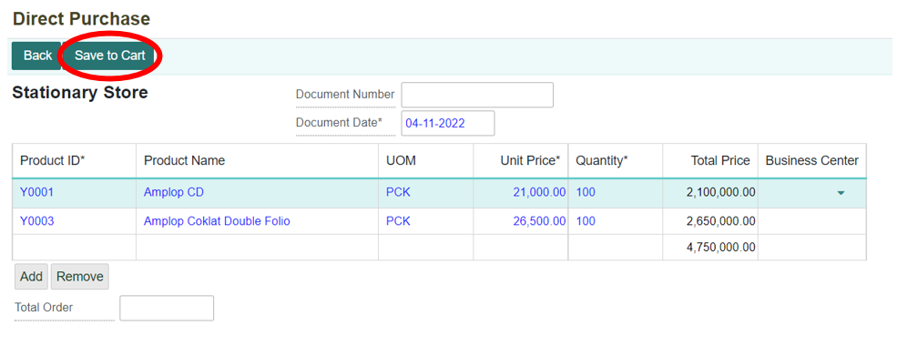

6. Kemudian klik tombol **Check Out** untuk melakukan pembayaran.
     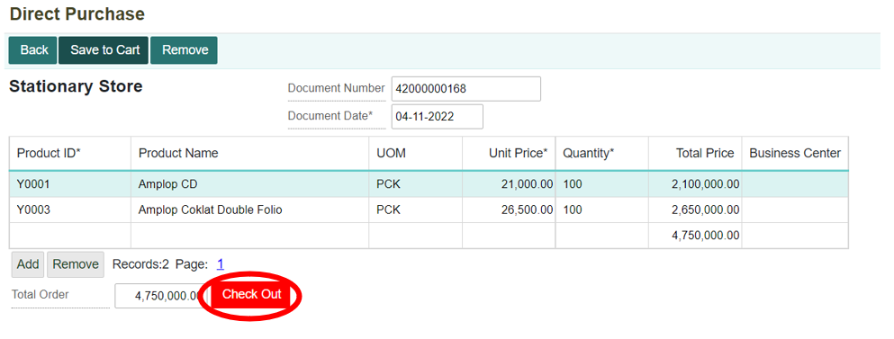

7. Kemudian pilih salah satu akun pembayaran yang akan digunakan untuk membayar, setelah itu klik tombol **OK.**
     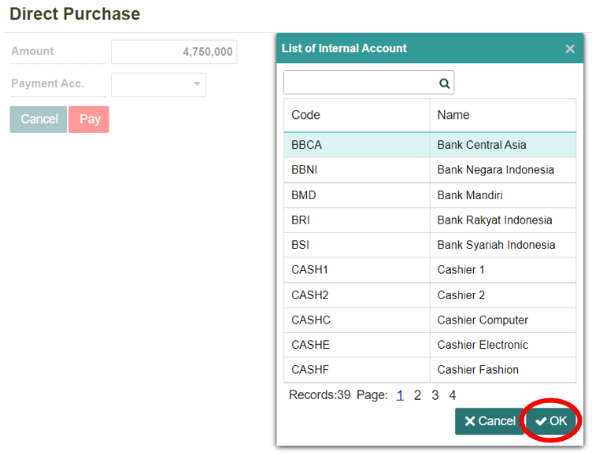

8. Setelah memilih akun pembayaran yang akan digunakan klik tombol **Pay** untuk melakukan pembayaran. Sebelum melakukan pembayaran pastikan transaksi yang dibuat sudah benar, karena jika setelah melakukan pembayaran transaksi tidak bisa dihapus.
     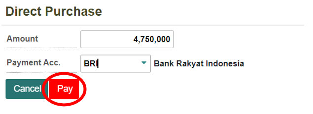

9. Kemudian akan muncul notifikasi transaksi pembayaran berhasil.
    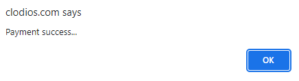

## Menghapus Transaksi Pembelian Barang Menggunakan Direct Purchase
1. Apabila ingin membatalkan transaksi, dapat melakukan penghapusan transaksi dengan klik tombol **Remove.**
    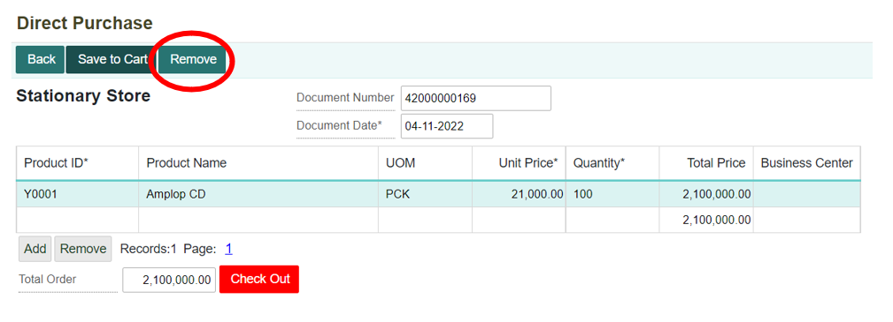

2. Kemudian akan muncul notifikasi informasi transaksi ini akan dihapus, jika ingin menghapus transaksi klik **OK.**
    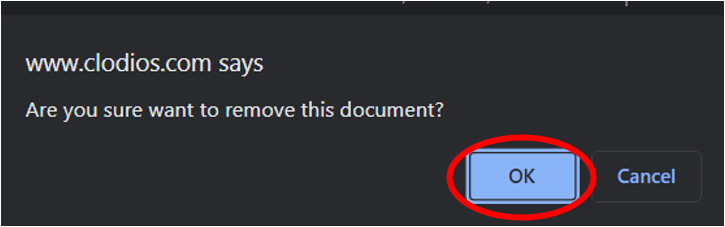

3. Jika ingin membatalkan menghapus transaksi klik tombol **Cancel.**
    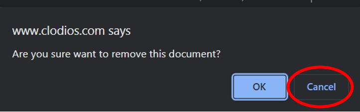 