# Product Setting

## Menu Product Setting
Menu product setting adalah menu yang digunakan untuk membuat pengaturan jenis suatu barang atau produk seperti kategori atau satuan barang. Di dalam menu Product Setting terdapat 4 sub menu yaitu Category, Product Type, Unit of Measure dan Storage.

Daftar isi :
1. Cara menjalankan menu product setting
2. Menambahkan category
3. Menambahkan category
4. Menghapus category
5. Menambahkan product type
6. Mengubah product type
7. Menghapus product type
8. Menambahkan unit of measure (UoM)
9. Mengubah unit of measure (UoM)
10. Menghapus unit of measure (UoM)
11. Menambahkan storage
12. Mengubah storage
13. Menghapus storage

## Cara Menjalankan Menu Product Setting
1. Untuk melakukan pengaturan pada produk atau barang, dapat dilakukan di dalam menu Product Setting. Klik module **Product Management** pada halaman utama.
    

2. Kemudian akan ditampilkan menu-menu yang terdapat pada module Product Management. Klik menu **Product Setting.**
    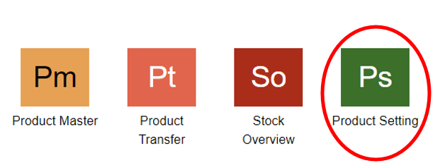

3. Selain itu, dapat membuka menu Product Setting dengan melakukan pencarian pada kolom pencarian. Lalu ketikkan kode menu **PRS.**
    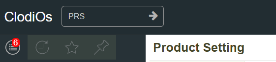

## Menambahkan Category
1. Pilih dan klik sub menu Category
    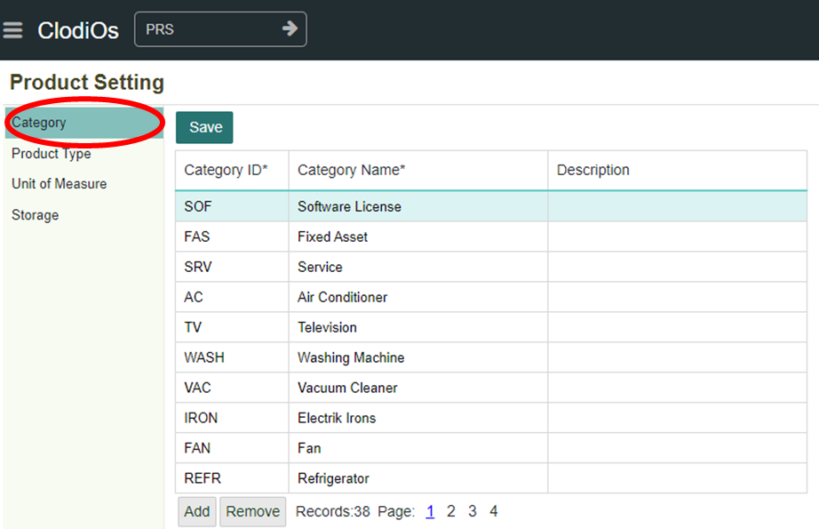

2. Klik **Add** maka akan muncul kolom kosong yang siap diisikan data baru.
    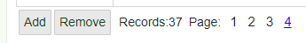

    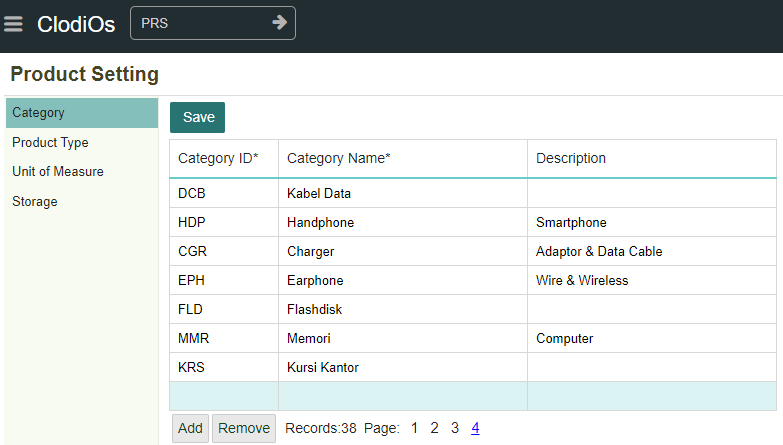

```{Note} * - Isi Semua kolom yang terdapat tanda (*)
            - Kolom Category ID harus unik.
```

**Informasi kolom**
| No  | Kolom       | Keterangan            |
| --- | ------------| ----------------------|
|  1  | Category ID | Kode Kategori         |
|  2  | Category Name | Nama Kategori       |
|  3  | Description | Keterangan            |

Klik tombol **Save** untuk menyimpan data.
    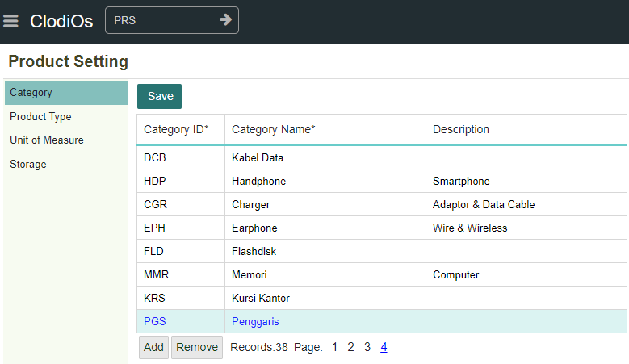

## Mengubah Category
1. Klik pada kolom yang akan diubah isinya sehingga baris data tersorot.

2. Ganti isi dari kolom tersebut dengan data baru.
    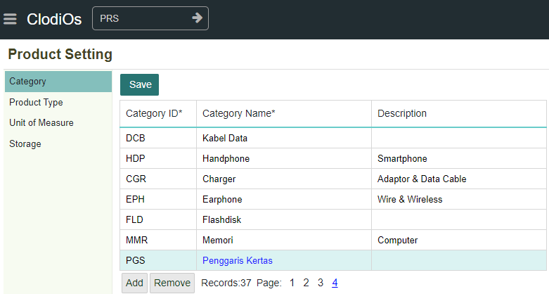

3. Klik tombol Save untuk menyimpan perubahan.

## Menghapus Category
1. Klik pada kolom yang akan diubah isinya sehingga baris data tersorot.

2. Klik tombol **Remove.** Maka baris data yang disorot akan hilang.
    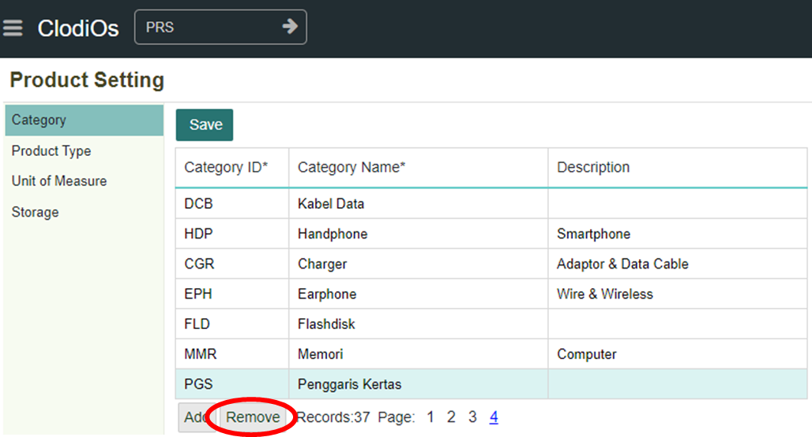

3. Klik tombol Save untuk menghapus data secara permanen.

## Menambahkan Product Type
1. Pilih dan klik sub menu **Product Type**
    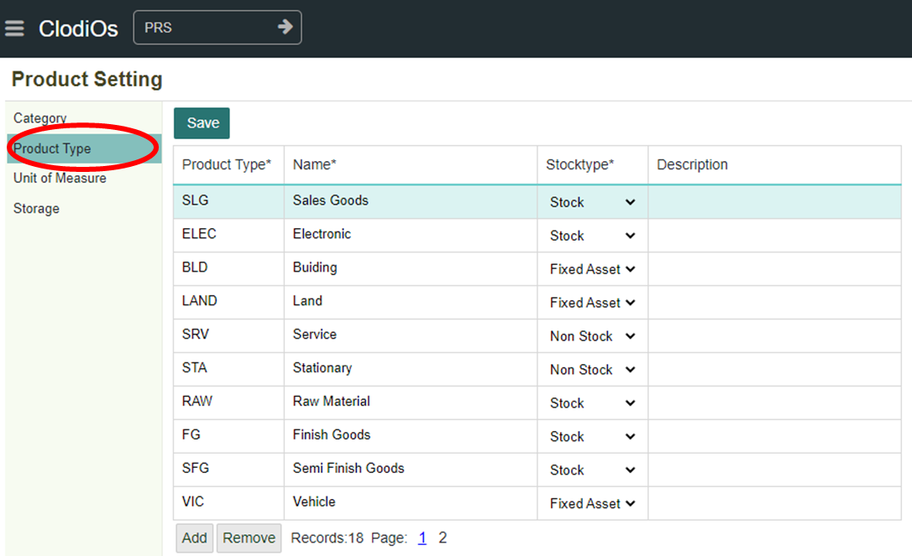

2. Tekan tombol **Add** kemudian akan muncul kolom kosong yang siap diisikan data baru.
    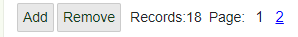

    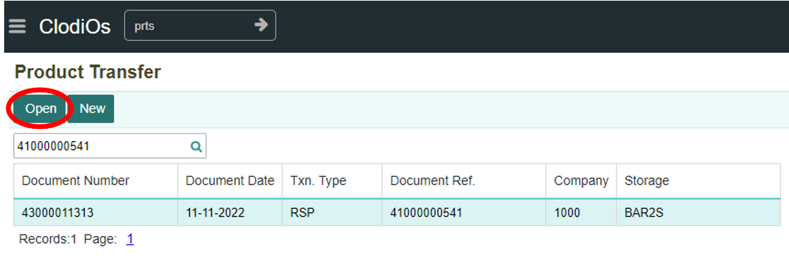

```{Note}  Isi semua kolom yang terdapat tanda (*)
	- Kolom Product Type harus unik.
	
	Pada kolom Stocktype terdapat 3 pilihan yaitu:
	- Stock merupakan jenis barang/produk yang akan dijual atau barang dagang.
	- Non Stock merupakan jenis barang/produk yang tidak harus di stok seperti jasa atau perlengkapan kantor.
	- Fixed Asset merupakan jenis barang/produk berupa asset berwujud atau harta dalam bentuk properti maupun peralatan dengan sifat jangka panjang atau lebih
	  dari satu tahun.
```

**Informasi Kolom**
| No  | Kolom          | Keterangan                |
| --- | ---------------| --------------------------|
|  1  | Product Type   | Kode Produk Type          |
|  2  | Name           | Nama Produk Type          |
|  3  | Stocktype      | Jenis Barang              |
|  4  | Description    | Keterangan                |

3.  Klik **Save** untuk menyimpan data.

    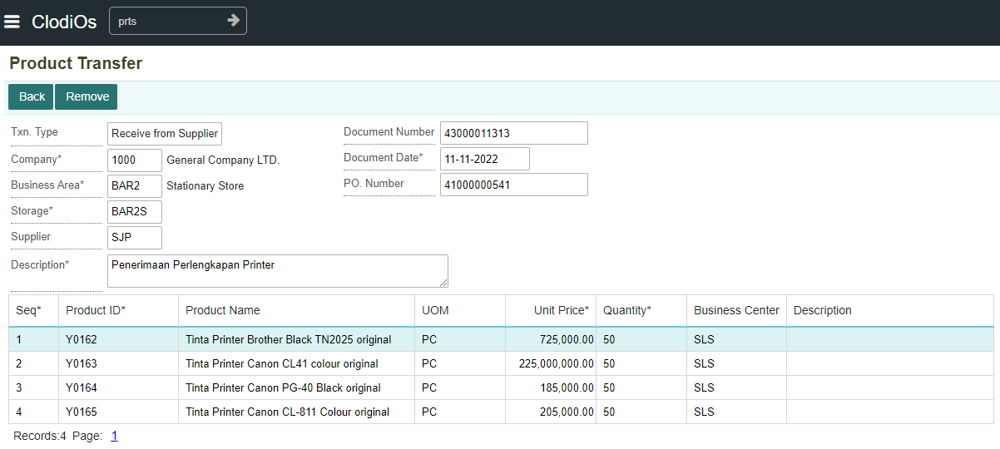

## Mengubah Produk Type
1. Klik pada kolom yang akan diubah isinya sehingga baris data tersorot.

2. Ganti isi dari kolom tersebut dengan data baru.
    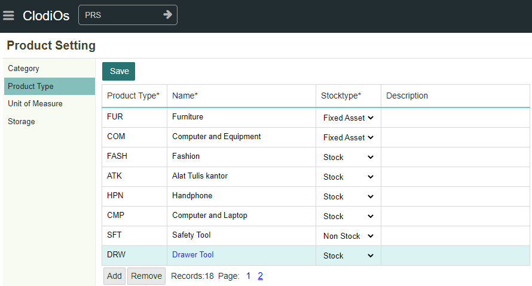

3. Klik **Save** untuk menyimpan perubahan.

## Menghapus Product Type
1. Klik pada kolom yang akan diubah isinya sehingga baris data tersorot.

2. Klik **Remove.** Maka baris data yang disorot akan hilang.
    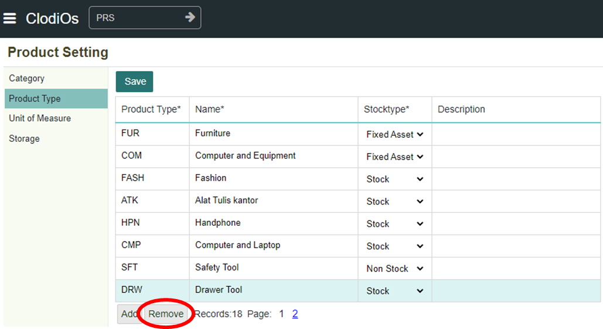

3. Klik **save** untuk menghapus data secara permanen.

## Menambahkan Unit of Measure
1. Pilih dan klik sub menu Unit of Measure
    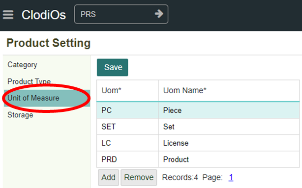

2. Klik tombol Add maka akan muncul kolom kosong yang siap diisikan data baru.
    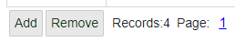

    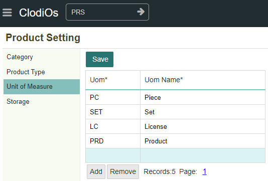

```{Note} * - Isi semua kolom yang terdapat tanda (*)
	        - Kolom Uom harus unik.
```

**Informasi kolom**
| No.  | Kolom      | Keterangan        |
| ---  | -----------| ------------------|
|  1   | UOM        | Kode Satuan Barang|
|  2   | UOM Name   | Nama Satuan       |

3. Klik tombol **Save** untuk menyimpan data.


## Mengubah Unit of Measure
1. Klik pada kolom yang akan diubah isinya sehingga baris data tersorot.

2. Ganti isi dari kolom tersebut dengan data baru.
    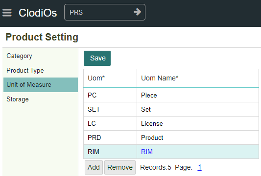

3. Klik **Save** untuk menyimpan perubahan.


## Menghapus Unti of Measure
1. Klik pada kolom yang akan diubah isinya sehingga baris data tersorot.

2. Klik tombol **Remove.** Maka baris data yang disorot akan hilang.
    

3. Klik tombol **Save** untuk menghapus
 data secara permanen.


## Menambahkan Storage
1. Pilih dan klik sub menu Storage
    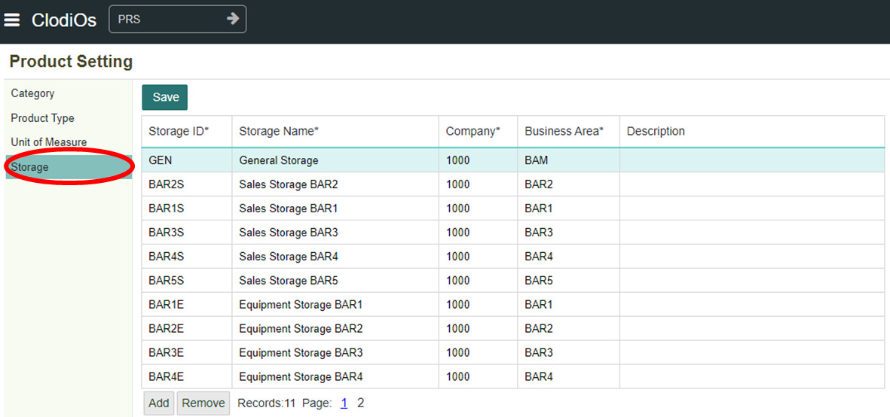

2. Klik tombol **Add** maka akan muncul kolom kosong yang siap diisikan data baru.
    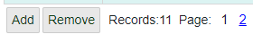

    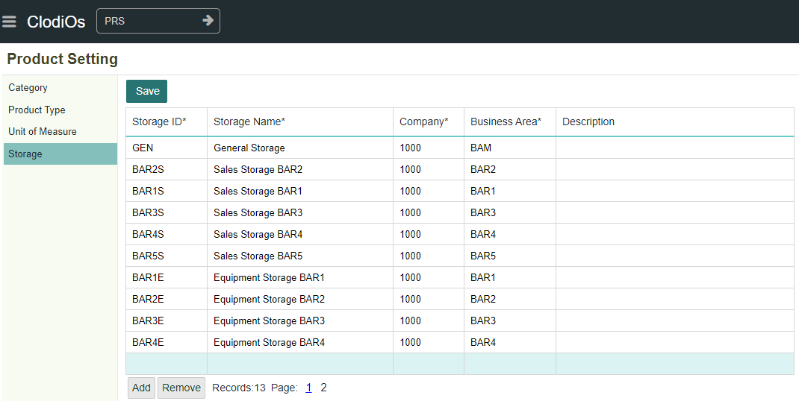

```{Note} * - Isi semua kolom yang terdapat tanda (*)
	- Kolom Storage ID harus unik.
	- Kolom Company dan Business Area jenisnya adalah pilihan, maka perlu ditambahkan data terlebih dahulu. Untuk menambahkan Company dapat dilihat pada module 
	  System menu General Setting(GNS) Sub Menu Company. Sedangkan untuk menambahkan Business Area dapat dilihat pada modul Accounting menu Setting(ACS) 
	  SubMenu Business Area
	- Kolom Company dan Business Area bisa dipilih melalui tombol list
```

**Informasi kolom**
| No.  | Kolom              | Keterangan                |
| ---  | -------------------| ------------------------- |
|  1   | Storage ID         | Kode Gudang               |
|  2   | Storage Name       | Nama Gudang               |
|  3   | Company            | Kode Perusahaan           |
|  4   | Business Area      | Kode Area Bisnis          |
|  5   | Description        | Keterangan                |

3. Klik tombol **Save** untuk menyimpan data.

## Mengubah Storage
1. Klik pada kolom yang akan diubah isinya sehingga baris data tersorot.

2. Ganti isi dari kolom tersebut dengan data baru.
    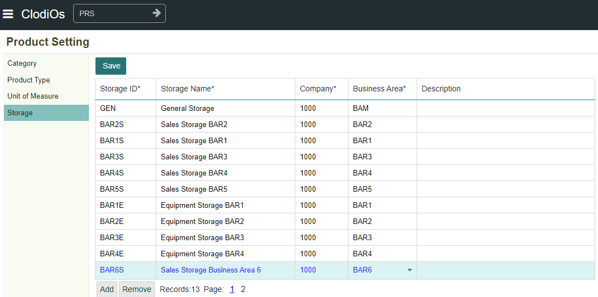

3. Klik tombol **Save** untuk menyimpan perubahan.

## Menghapus Storage
1. Klik pada kolom yang akan diubah isinya sehingga baris data tersorot.

2. Klik tombol **Remove.** Maka baris data yang disorot akan hilang.
    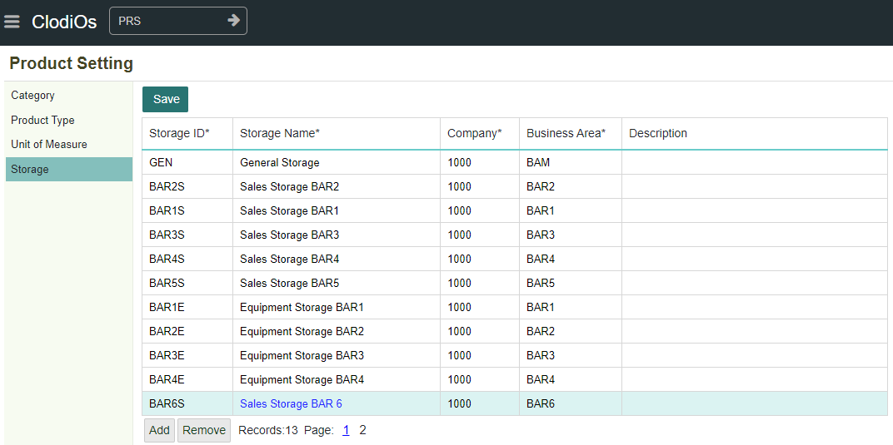

3. Klik tombol **Save** untuk menghapus data secara permanen.