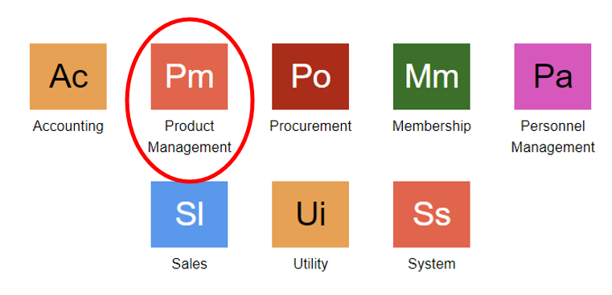
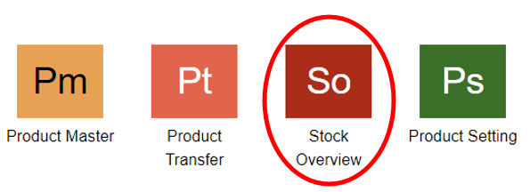
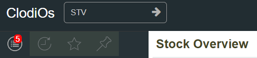
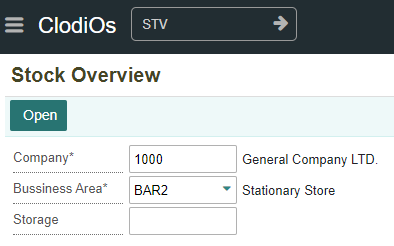
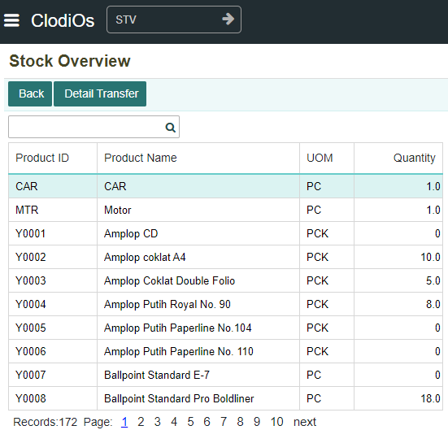
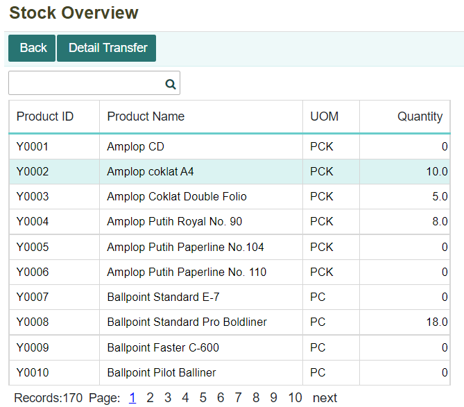
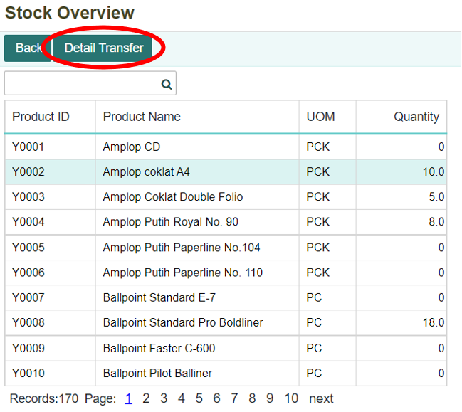
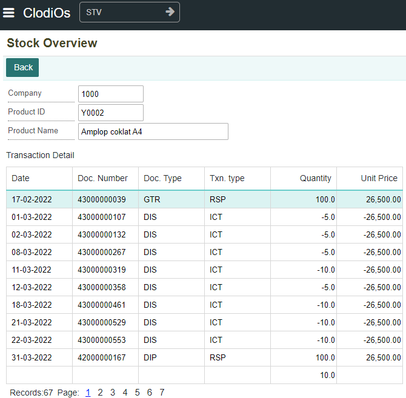

# Stock Overview

## Menu Stock Overview
Menu stock overview adalah menu yang digunakan untuk melakukan cek stok barang dan dapat melihat pergerakan barang.

Daftar isi :
1. Cara menjalankan menu stock overview
2. Menampilkan informasi stock barang
3. Menampilkan detail pergerakan barang

## Cara Menjalankan Menu Stock Overview
1. Untuk mengetahui informasi mengenai stok dan pergerakan barang dapat dilakukan di dalam menu Stock Overview. Klik module **Product Management** pada halaman utama.
    

2. Setelah itu, akan ditampilkan menu-menu yang terdapat di dalam module Product Management. Klik menu **Stock Overview.**
    

3. Selain itu, dapat membuka menu Stock Overview dengan melakukan pencarian pada kolom pencarian. Lalu ketikkan kode menu **STV.**
    

# Menampilkan Informasi Stock Barang
1. Maka akan ditampilkan form, isi dan lengkapi setiap kolom yang ada. Lalu klik **Open**, sehingga tampil daftar barang dan informasi stok yang tersedia.
    

2. Selanjutnya akan ditampilkan informasi mengenai daftar barang dan stok barang yang dimiliki
    

# Menampilkan Pergerakan Barang
1. Untuk menampilkan detail pergerakan barang pilih dan klik salah satu barang yang ingin dilihat mengenai informasinya, seperti gambar berikut.
    

Selanjutnya klik tombol **Detail Transfer.**
    

**Informasi kolom**
| No  | Nama Kolom          | Keterangan            |
| --- | --------------------| ----------------------|
|  1  | Product ID          | Kode Produk           |
|  2  | Product Name        | Nama Produk           |
|  3  | UOM                 | Satuan Produk/Barang  |
|  4  | Quantity            | Jumlay Stock          |

3. Maka akan muncul tampilan seperti dibawah
    

**Informasi kolom**
| No  | Nama Kolom                  | Keterangan                    |
| --- | ----------------------------| ------------------------------|
|  1  | Company                     | Kode Perusahaan               |
|  2  | Product ID                  | Kode Produk                   |
|  3  | Product Name                | Nama Produk                   |
|  4  | Date                        | Tanggal Transaksi             |
|  5  | Doc.Number                  | Nomor Dokumen                 |
|  6  | Doc.Type                    | Jenis Dokumen                 |
|  7  | Txn.Type                    | Jenis Transaksi               |
|  8  | Quantity                    | Jumlah Produk                 |
|  9  | Unit Price                  | Harga Pokok Penjualan         |
