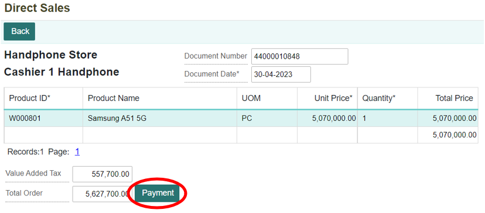

# Direct Sales

## Menu Diredct Sales
Menu direct sales merupakan menu yang digunakan untuk melakukan transaksi penjualan secara langsung, yang dilakukan oleh kasir dan pembeli di toko.

Daftar Isi :

1. Cara menjalankan menu direct sales
2. Membuat transaksi penjualan melalui direct sales
3. Membuka dokumen transaksi direct sales
4. Menghapus transaksi penjualan melalui direct sales

## Cara Menjalankan Menu Direct Sales
1. Untuk melakukan transaksi penjualan barang dagang secara langsung, dapat dilakukan dalam module Sales. Klik **Sales pada halaman utama.**
    

2. Kemudian akan ditampilkan menu-menu yang terdapat pada module sales. Setelah itu, klik **Direct Sales.**
    

3. Selain itu, dapat membuka menu direct sales dengan melakukan pencarian pada kolom pencarian di aplikasi, Lalu ketikkan kode menu **DSL.**
     

## Membuat Transaksi Penjualan Barang Dagang Melalui Direct Sales
1. Selanjutnya masuk ke dalam menu direct sales akan ditampilkan form untuk melakukan direct sales, lengkapi semua kolom. Kemudian klik tombol **Next.**
    

```{note} * Isi semua kolom yang bertanda (*)
```

**informasikolom**
| No   | Kolom                      | Keterangan                         |
| ---  | ----------------------     | -----------------------------      |
|  1   | Company                    | Kode Perusahaan                    |
|  2   | Business Area              | Kode Area Bisnis                   |
|  3   | Point of Sales             | Kasir yang Akan Di Gunakan         |
|  4   | Costumer                   | Konsumen Yang Melalkukan Pembelian |
|  5   | Storage                    | Kode Ruang Penyimpanan             |
|  6   | Currecy                    | Mata Uang Yang Digunakan           |

2. Maka akan ditampilkan daftar transaksi penjualan yang sudah dilakukan sebelumnya. Untuk membuat transaksi penjualan baru, klik tombol **New.**
    

3. Akan ditampilkan form untuk melakukan transaksi penjualan. Kasir perlu memasukkan barang-barang yang dibeli oleh customer dan sistem akan otomatis menampilkan harga barang tersebut. Selanjutnya sistem akan otomatis menghitung total harga belanjaan customer (pembeli) + PPN. Kemudian klik tombol **Save to Cart.**
    

Tombol **Add** untuk menambahkan record (menambahkan barang yang dibeli). Sedangkan tombol **Remove** untuk menghapus record (barang yang sudah dimasukkan).

```{note} * Isi semua kolom yang bertanda (*)
```

**Informasikolom**
| No   | Kolom                      | Keterangan                            |
| ---  | ----------------           | ----------------------                |
|  1   | Document Number	        | Kode Dokumen Direct Sales
|  2   | Document Date	            | Tanggal Pembuatan Dokumen atau Tanggal Transaksi                                                                   |
|  3   | Product Id	                | Kode Produk                           |
|  4   | Product Name	            | Nama Produk                           |
|  5   | UOM	                    | Satuan Barang                         |
|  6   | Quantity	                | Jumlah Barang yang Dibeli         
|  7   | Total Price	            | Total Harga Pembelian Produk (PerProduk)                                                                 |
|  8   | Total Order	            | Total Harga Belanjaan (Keseluruhan Harga Barang + PPN)                                                         |
|  9   | Value Added Tax	        | Pajak Pertambahan Nilai (PPN)         |

4. Selanjutnya akan tertera total harga belanjaan yang perlu dibayarkan customer (sudah termasuk PPN). Kemudian klik tombol **Check Out** untuk melakukan pembayaran.
    

5. Setelah itu, masukan metode pembayaran yang digunakan (cash atau transfer), lalu klik tombol **Eccept Payment.** Apabila customer memilih metode pembayaran cash, kolom **Cash** diisi untuk total uang yang diterima dari pembeli, dan kolom **Exchange** terisi otomatis oleh sistem mengenai uang kembalian yang harus diberikan kepada pembeli.
    

6. Dan apabila customer memilih transfer, maka akan untuk kolom **Account** diisi sesuai dengan pilihan pembeli, dapat melalui bank atau e-wallet. Lalu klik tombol **Eccept Payment.** 
    

7. Maka akan muncul notifikasi bahwa pembayaran berhasil.
    

## Membuka Dokumen Transaksi Direct Sales
1. Dokumen transaksi direct sales dapat dibuka kembali, hal ini dapat dilakukan dengan memilih salah satu dokumen direct sales. Kemudian klik tombol **Open.**
    

2. Selanjutnya akan ditampilkan dokumen direct sales tersebut. Klik tombol **Payment,** untuk melihat pembayaran dari transaksi tersebut.
    

3. Maka akan ditampilkan total belanjaan, VAT, dan juga metode pembayaran yang digunakan. Klik tombol **Back,** untuk kembali ke halaman sebelumnya.
    

# Menghapus Transaksi Penjualan Melalui Direct Sales
1. Apabila tidak jadi dilakukan transaksi, maka dapat melakukan penghapusan dokumen transaksi, dengan klik tombol **Remove.**
    

2. Maka akan tampil notifikasi konfimasi penghapusan dokumen. Klik tombol **OK,** maka dokumen akan otomatis terhapus.
    

3. Apabila ingin membatalkan penghapusan, maka klik tombol **Cancel.**
    