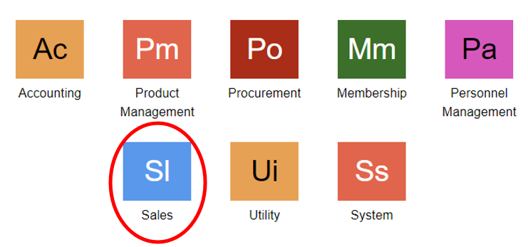

# Sales Order

## Menu Sales Order
Menu sales order merupakan menu yang digunakan untuk melakukan transaksi penjualan dalam jumlah banyak dari customer, atau melalui pemesanan dari customer kepada sales.

Daftar Isi :

1. Cara menjalankan menu sales order
2. Membuat transaksi penjualan barang melalui sales order
3. Membuka dokumen transaksi sales order
4. Menghapus transaksi penjualan barang melalui sales order

## Cara Menjalankan Menu Sales Order
1. Customer akan melakukan pemesanan barang kepada sales, sehingga sales perlu membuat dokumen pemesanan barang di dalam sales order. Hal tersebut, dapat dilakukan di dalam module sales. Klik **Sales** pada halaman utama.
    

2. Kemudian akan ditampilkan menu-menu yang terdapat pada module sales. Setelah itu, klik **Sales Order.**
    

3. elain itu, dapat membuka menu sales order dengan melakukan pencarian pada kolom pencarian di aplikasi, Lalu ketikkan kode menu **SLO**
    

## Membuat Transaksi Penjualan Barang Melalui Sales Order
1. Setelah masuk ke dalam menu Sales Order, maka akan ditampilkan daftar transaksi penjualan yang sudah dilakukan sebelumnya. Untuk membuat transaksi penjualan baru, klik tombol **New.**
    

2. Lengkapi dan isi setiap kolom-kolom yang ada untuk form sales order. Setelah semua kolom telah terisi, kemudian klik tombol **Save** untuk menyimpan dokumen transaksi sales order
    

Tombol **Add** untuk menambahkan record (menambahkan barang yang dibeli). Sedangkan tombol **Remove** untuk menghapus record (barang yang sudah dimasukkan).

```{note} * Isi semua kolom yang bertanda (*)
```

**Informasikolom**
| No   | Kolom               | Keterangan                                   |
| ---  | ----------------    | ------------------------------               |
|  1   | Company             | Kode Perusahaan                              |
|  2   | Business Area	     | Kode Bisnis Area yang Dilakukan Transaksi    |
|  3   | Customer	         | Kode Konsumen                                |
|  4   | Currency	         | Mata Uang yang Digunakan                     |
|  5   | Description         | Keterangan                                   |
|  6   | Document Number	 | Nomor Dokumen Sales Order                    |
|  7   | Document Date	     | Tanggal Pembuatan Dokumen Sales Order        |
|  8   | Document Ref	     | Nomor Dokumen Referensi                      |
|  9   | Seq	             | Nomor Urut Record                            |
|  10  | Product ID	         | Kode Produk                                  |
|  11  | Product Name	     | Nama Produk                                  |
|  12  | UOM                 | Satuan Barang                                |
|  13  | Unit Price	         | Harga Barang Satuan                          |
|  14  | Quantity            | Jumlah Banyaknya Barang                      |
|  15  | Tax                 | Jenis Pajak yang Digunakan                   |
|  16  | Business Center	 | Kode Tempat Bisnis Berlangsung               |
|  17  | Value Added Tax	 | Pajak Pertambahan Nilai (PPN)                |
|  18  | Witholding Tax	     | Pajak yang Dikenakan untuk Barang + Jasa     |
|  19  | Total Order	     | Total Harga Belanjaan (Keseluruhan Harga Barang + PPN)                                                               |

## Membuka Dokumen Transaksi Sales Order
1. Dokumen transaksi sales order dapat dibuka kembali, hal ini dapat dilakukan dengan memilih salah satu dokumen sales order. Kemudian klik tombol **Open.**
    

2. Setelah itu, akan ditampilkan dokumen sales order yang ingin dibuka atau dilihat. Klik tombol **Back,** untuk kembali ke halaman sebelumnya
    

## Menghapus Dokumen Transaksi Sales Order
1. Apabila ingin menghapus dokumen sales order yang telah dibuat, cukup dengan klik tombol **Remove.**
    

2. Maka akan tampil notifikasi konfimasi penghapusan dokumen. Klik tombol **OK,** maka dokumen akan otomatis terhapus.
    

3. Apabila ingin membatalkan penghapusan, maka klik tombol **Cancel.**
    