# Sales Setting

## Menu Sales Setting
Menu sales setting merupakan menu untuk mengatur atau menambahkan kasir-kasir (point of sales) yang ada di perusahaan. Selain itu, untuk menambahkan metode-metode pembayaran yang akan digunakan oleh kasir (point of sales). 

Daftar isi :

1. Cara menjalankan menu sales setting
2. Menambahkan daftar kasir (point of sales) untuk penjualan direct sales
3. Menghapus daftar kasir (point of sales) untuk penjualan direct sales
4. Menambahkan metode pembayaran untuk point of sales
5. Menghapus metode pembayaran untuk point of sales

## Cara Menjalankan Menu Sales Setting

1. Apabila ingin menghapus atau menambahkan kasir baru dan membuat metode pembayaran untuk setiap kasir (point of sales), maka hal tersebut, dapat dilakukan di dalam module sales. Klik **Sales** pada halaman utama.
    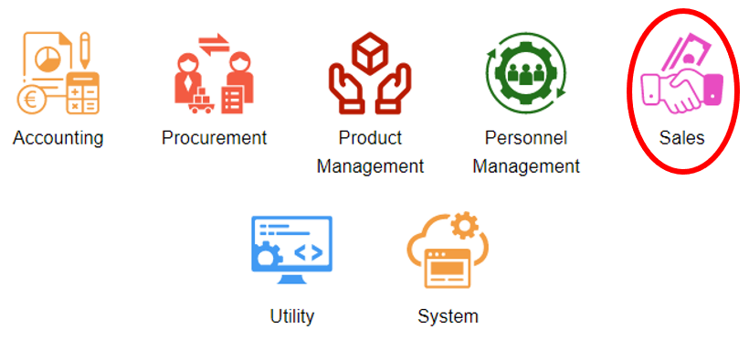

2. Kemudian akan ditampilkan menu-menu yang terdapat pada module sales. Setelah itu, klik **Sales Setting.**
    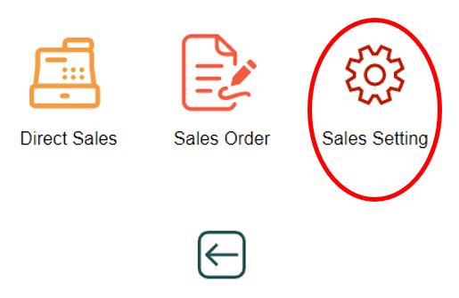

3. Selain itu, dapat membuka menu sales setting dengan melakukan pencarian pada kolom pencarian di aplikasi, Lalu ketikkan kode menu **SST**
    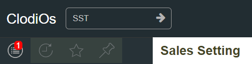

## Menambahkan Daftar Kasir (Point of Sales) untuk Penjualan Direct Sales

1. Setelah berhasil masuk ke dalam menu sales setting, maka akan ditampilkan pengaturan untuk point of sales (kasir). Dapat dilihat daftar dari point of sales yang sudah didaftarkan atau sudah dibuat.
    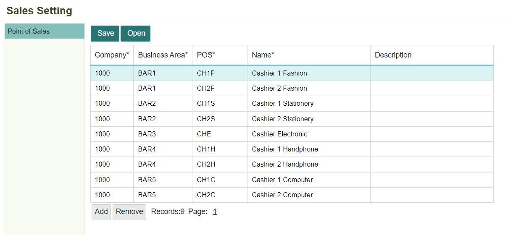

2. Untuk menambahkan point of sales yang baru, dapat dengan klik tombol **Add.**
    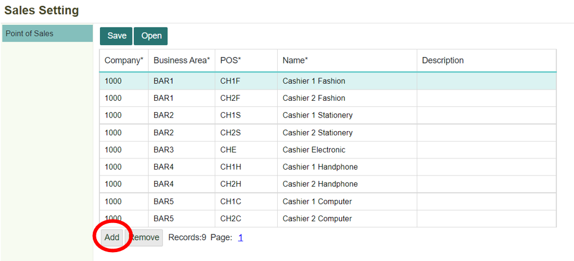

```{Note} * isi semua kolom yang bertanda (*)
```

**Informasi kolom**
| No  | Kolom                   | Keterangan                        |
| --- | --------------------    | --------------------------------  |
|  1  | Company                 | Kode Perusahaan                   |
|  2  | Business Area           | Kode Area Bisnis Point of Sales   |
|  3  | POS                     | Kode Untuk Point Of Sales         |
|  4  | Name                    | Nama dari Point of Sales          |
|  5  | Description             | Keterangan                        |

3. Setelah itu, akan bertambah kolom (record) yang baru, Lengkapi semua kolom, kemudian klik tombol Save untuk menyimpan data kolom yang baru saja ditambahkan atau dibuat.
    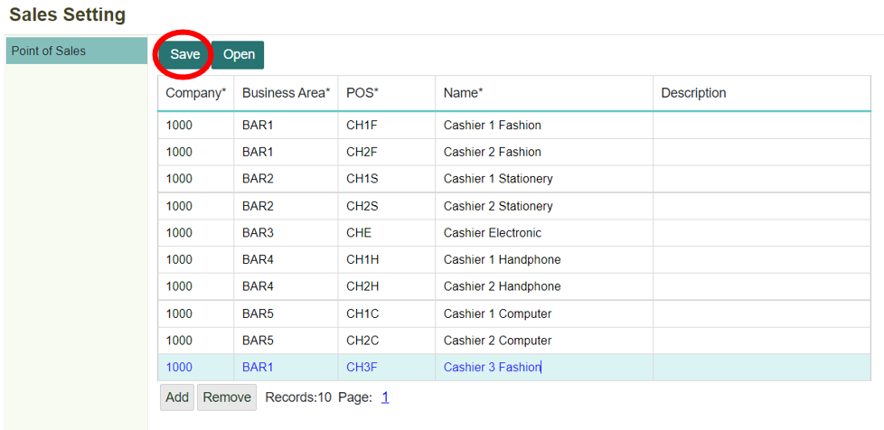

4. Selanjutnya akan tampil notifikasi bahwa data berhasil disimpan. Kemudian klik **OK.**
    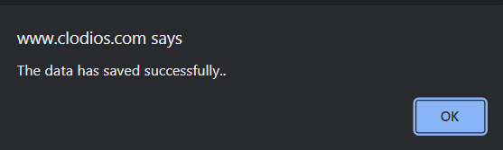

## Menghapus Daftar Kasir (Point of Sales) untuk Penjualan Direct Sales
1. Apabila ingin menghapus salah satu point of sales dari daftar (record). Dapat dengan cara, memilih salah satu point of sales yang ingin dihapus. Kemudian klik **Remove.**
    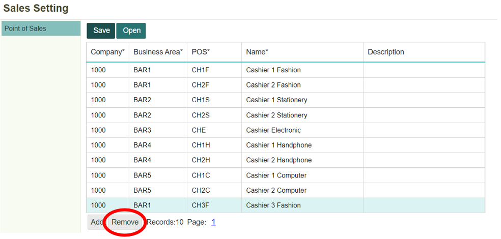

2. Setelah itu, record akan otomatis terhapus, kemudian klik **Save.**
    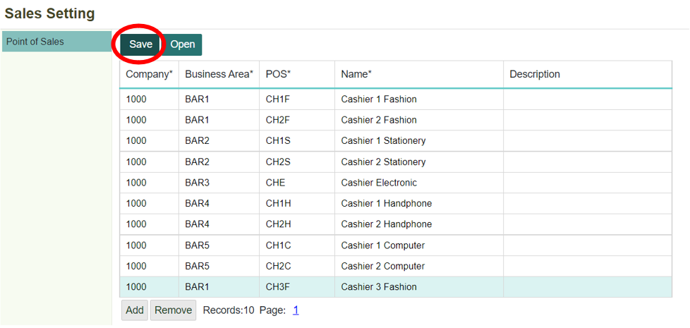

3. Maka akan muncul kembali notifikasi, data berhasil disimpan.
    

# Menambahkan Metode Pembayaran untuk Point of Sales
1. Setiap point of sales tentunya diperlukan beberapa metode pembayaran untuk direct sales. Hal ini, dapat ditambahkan dengan cara memilih atau klik salah satu point of sales (kasir) yang akan diatur metode pembayarannya. Kemudian klik tombol **Open.**
    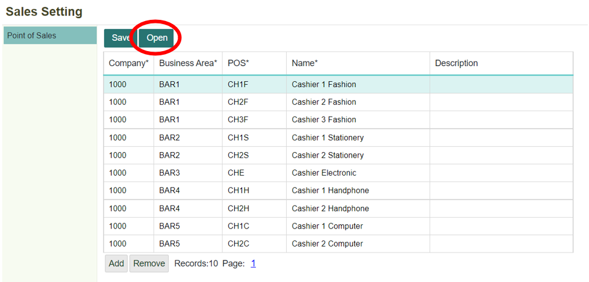

2. Maka akan ditampilkan daftar metode pembayaran dari point of sales tersebut yang sudah dibuat sebelumnya. Untuk menambahkan record baru, dapat dengan klik tombol **Add.**
    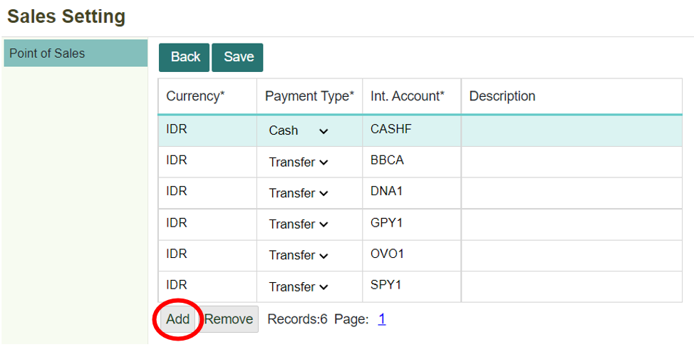

3. Setelah itu, akan bertambah field (record) yang baru, Lengkapi semua field, kemudian klik tombol **Save** untuk menyimpan data field yang baru saja ditambahkan atau dibuat. Selanjutnya akan tampil notifikasi bahwa data berhasil disimpan.
    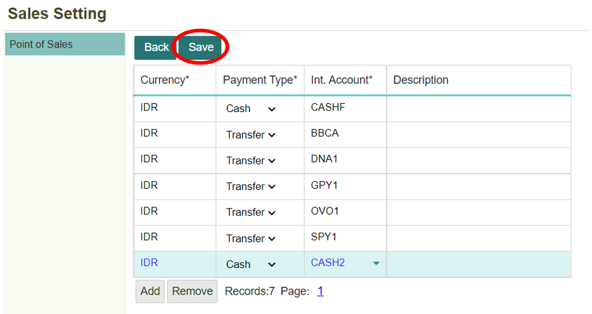

```{note} * Isi semua kolom yang bertanda (*)
```

**Informasikolom**
| No   | Kolom                | Keterangan                                  |
| ---  | --------------       | --------------------------                  |
|  1   | Currency             | Mata Uang yang Digunakan                    |
|  2   | Payment Type	      | Tipe-Tipe Pembayaran yang akan Digunakan (Cash atau Transfer)                                                        |
|  3   | Int. Account	      | Kode untuk Internal Account yang Digunakan  |
|  4   | Description          | Keterangan untuk Metode Pembayaran Tersebut |

# Menghapus Metode Pembayaran untuk Point of Sales
1. Apabila ingin menghapus salah satu metode pembayaran dari daftar (record). Dapat dengan cara, memilih salah satu metode pembayaran yang ingin dihapus. Kemudian klik tombol **Remove.**
    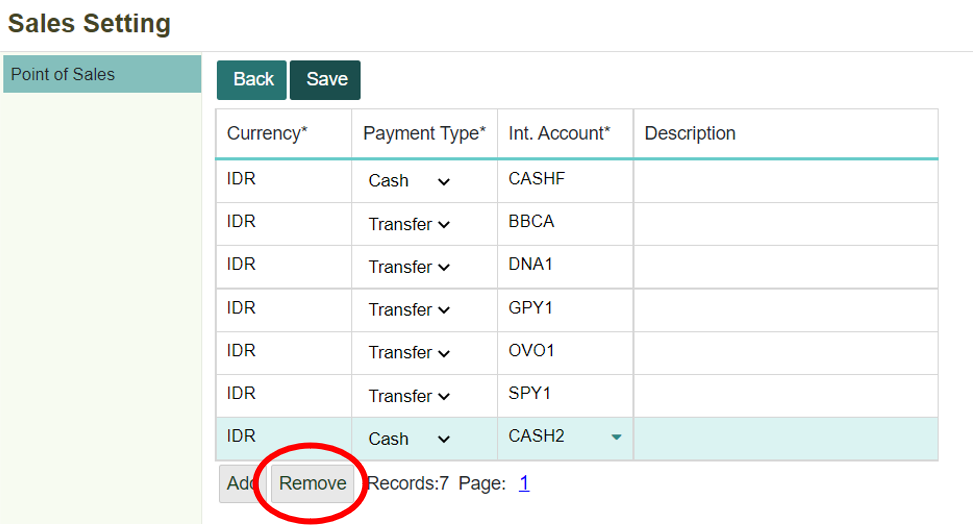

2. Setelah itu, record akan otomatis terhapus, kemudian klik tombol **Save** untuk menyimpan data.
    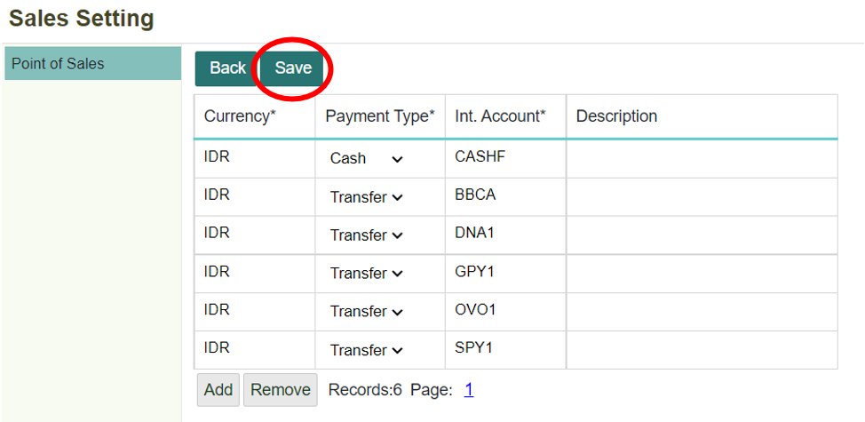

3. Maka akan tampil notifikasi bahwa data berhasil tersimpan.
    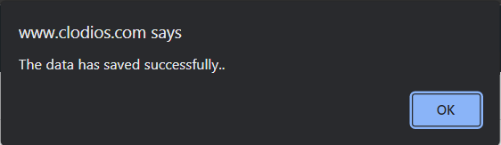

4. Kemudian setelah selesai melakukan pengaturan untuk metode pembayaran dan ingin kembali ke halaman sebelumnya. Dengan cara, klik tombol **Back.**
    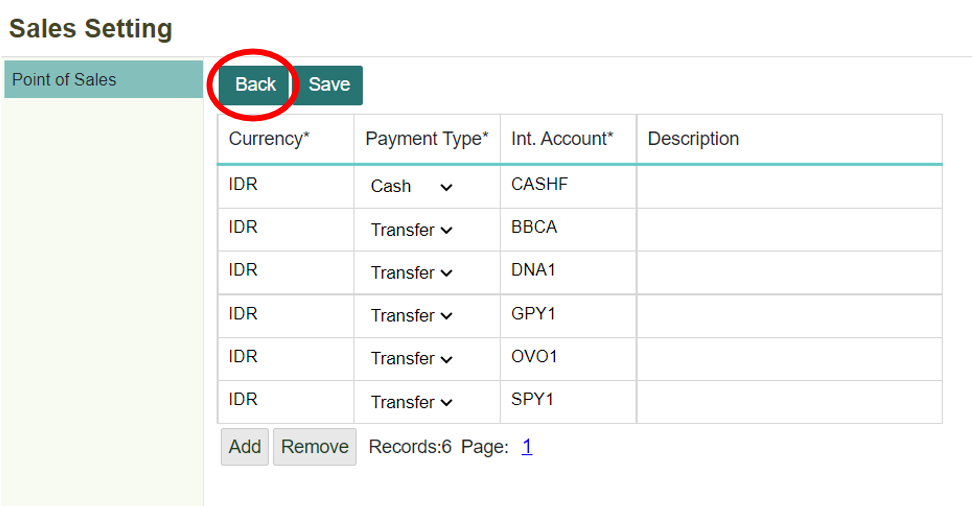